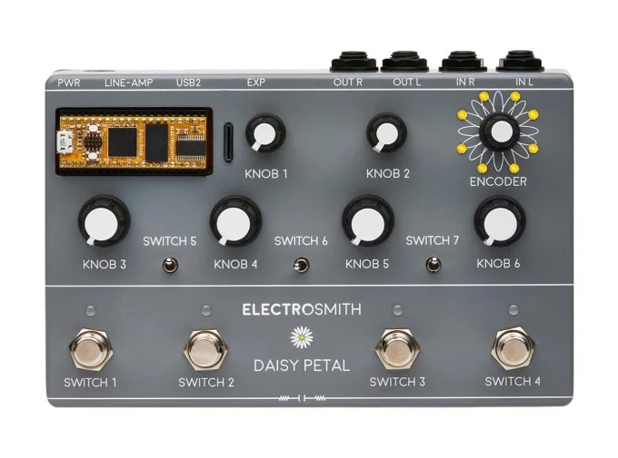
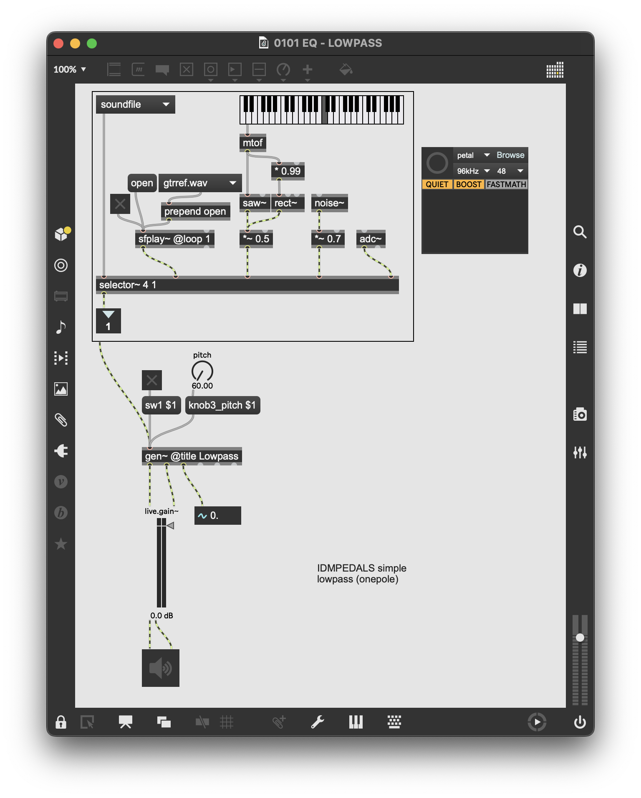
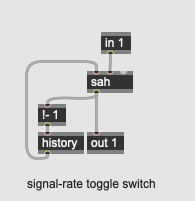
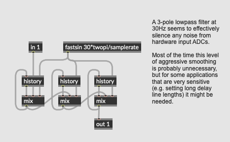

# NYU Integrated Design & Media
## IDM PEDALS
How to make effect pedals based on the [Electrosmith Daisy](https://www.electro-smith.com/daisy)!

NYU Tandon Undergraduate Summer Research Project, 2021-22

Last updated Fall, 2022.

- [Overview](#overview)
- [Oopsy Basics](#oopsy-basics)
- [Glossary](#glossary)
- [The Pedals](#pedals)
  - [EQ](#eq)
    - [Lowpass Filter](#eq-lowpass)
    - [Parametric EQ](#eq-parametric)
    - [Fixed Crossover Filter](#eq-xover)
    - [Variable Crossover Filter](#eq-xover2)
    - [Mu-Tron Wah](#eq-wah)
    - [LFO Auto-Wah](#eq-wah2)
    - [Formant Filter](#eq-formant)
    - [Vocoder](#eq-vocoder)
  - [Dynamics](#dynamics)
    - [Tremolo / Univibe](#dyn-tremolo)
    - [Compressor / Limiter](#dyn-compressor)
    - [Gate](#dyn-gate)
  - [Distortion](#distortion)
    - [Overdrive](#dist-overdrive)
    - [Fuzz](#dist-fuzz)
    - [Octave Fuzz](#dist-octavia)
    - [Amp Distortion](#dist-distortion) 
    - [Crunch Distortion](#dist-distortion2) 
    - [Clipping, Folding, Wrapping](#dist-waveshaper) 
    - [Parametric Waveshaping](#dist-waveshaper2) 
  - [Modulation](#modulation)
    - [Simple Chorus](#mod-chorus) 
    - [Chorus Ensemble](#mod-chorus2) 
    - [Flanger](#mod-flanger) 
    - [Simple Phaser](#mod-phaser) 
    - [Multi-stage Phaser](#mod-phaser2) 
    - [Harmonizer](#mod-harmonizer) 
    - [S&H Comb](#mod-shcomb) 
    - [Harmonic Filters](#mod-shcomb2) 
  - [Delay](#delay)
    - [Digital Delay](#del-digitaldelay) 
    - [Multi-tap Delay](#del-digitaldelay2) 
    - [Chowning Reverb](#del-reverb) 
    - [Freeverb](#del-reverb2) 
    - [Creepy Reverb](#del-reverb3) 
  - [Special FX](#special)
    - [Subharmonic Oscillator](#sfx-subharmonic) 
    - [Sample-and-Hold Sine](#sfx-shsine) 
    - [Ring Modulator](#sfx-ringmod) 
    - [Frequency Shifter](#sfx-freqshift) 
    - [FM Delay](#sfx-fmdelay) 
    - [Glitch Sampler](#sfx-glitch) 
    - [Reverse Sampler](#sfx-glitch2) 
    - [Yin Synthesizer](#sfx-yin) 

# Overview

**IDM Pedals** is an open-source repository of audio signal processing algorithms designed, from a user experience standpoint, to be deployed as [effects pedals](https://en.wikipedia.org/wiki/Effects_unit). The repository contains software implementations of a wide variety of effects, ranging from canonical 1960s analog distortions to common digital effects from the 1980s to studies on more modern and esoteric effects. The repository consists of Max/MSP patches written in the [**gen~**](https://docs.cycling74.com/max8/vignettes/gen_overview) language and intended to be used with the [Electrosmith Daisy](https://www.electro-smith.com/) platform; the system used in this repository can be easily adapted to other architectures, however, including software-only (VST, Max4Live), or other embedded implementations (via the C++ code export or the [RNBO](https://rnbo.cycling74.com/) system). 

The project is intended to be a resource for people interested in learning about:
* Digital signal processing algorithms specifically designed for modifying an input audio signal ("audio effects")
* Historical analog and digital audio effects design
* Effects pedals
* The gen~ architecture of Max and the Electrosmith Daisy platform
* Any combination of the above

# Oopsy basics

The **IDM Pedals** project uses the [oopsy](https://github.com/electro-smith/oopsy) package to transmit gen~ patches in Max/MSP directly to an Electrosmith Daisy chip. The patches in this repository are designed for the [Daisy Petal](https://www.perfectcircuit.com/electrosmith-daisy-petal.html) prototyping board:

The patches contained in the repository consists of numbered and categorized Max/MSP patches that each contain a gen~ subpatch to be uploaded to the Daisy chip. *The gen~ patcher is the actual effect algorithm*; the host Max/MSP patch contains objects for previewing and working with the patch in Max.

The Max/MSP patches all rely on a **bpatcher** object called "testinput_bpatch.maxpat", as well as **toggle** and **live.dial** objects to simulate using the effect within Max, e.g.:

An oopsy **bpatcher** in each patch (seen in the upper-right of the example above) allows you to transmit the **gen~** code to the Daisy directly from Max. If you double-click the **gen~** object in the middle of the patch, you will see the actual effect algorithm that will be sent to the chip.

There are a number of utility abstractions used by the **gen~** code in this project, most notably:

This is a "software toggle" algorithm to allow the left-hand toggle switch on the Daisy Petal board to act as a bypass switch for the effect. If you want to use these algorithms in a different context, this is probably the first thing you would remove.

This is a third-order smoothing filter that is applied to many (but not all) knob inputs in the algorithms in this project; this helps prevent any A/D jitter from the analog controls on the physical pedal from having a negative effect on the effect's behavior.

# Glossary

Effects pedals (and audio signal processing techniques in general) have a jargon. Before looking at the pedals themselves, here's a brief glossary of some terms commonly found in effect pedal documentation; many others will be introduced when talking about the pedals themselves:

- [**Analog Electronics**](https://en.wikipedia.org/wiki/Analogue_electronics) - refers to electronic circuits that work - at least primarily - with continuous (as opposed to discrete) signal levels. More broadly, an **analog** signal can be thought of as any representation of a phenemenon (e.g. a sound pressure wave) that is *analogous* to the phenomenon itself; this is in contrast to a **digital** signal, where the signal is quantized and encoded into numerical values that are represented in electronic systems through discrete (typically binary - on or off) signals.

- [**Analog to Digital Converter**]([https://en.wikipedia.org/wiki/CV/Gate](https://en.wikipedia.org/wiki/Analog-to-digital_converter)) (**ADC** or **A/D**) - circuitry that takes a continuous (*analog*) signal and converts it into a discrete, numerical *sample* encoded as a *digital* signal. The speed at which the conversion of the signal occurs is called the *sampling rate*; the resolution (range of values) of each sample is called the *bit depth*. Different media have different common techniques for analog-to-digital conversion, including [Pulse Code Modulation](https://en.wikipedia.org/wiki/Pulse-code_modulation) (PCM) and [Sigma-Delta](https://en.wikipedia.org/wiki/Delta-sigma_modulation) (Σ-Δ).

- [**Bit Depth**](https://en.wikipedia.org/wiki/Audio_bit_depth) - the number of bits allocated for each sample in a digital audio signal; in [PCM]((https://en.wikipedia.org/wiki/Pulse-code_modulation))-encoded audio, this value directly correlates to the resolution of how the signal's amplitude is recorded. Each additional bit of resolution doubles the range of possible values for the sample, giving approximately a 6dB boost to the signal-to-noise ratio. CD-quality audio has a 16-bit resolution (with sample values in the range of −32,768 to +32,767); modern professional-quality audio systems typically have a 24-bit resolution or higher.

- [**Bucket-Brigade Device**](https://en.wikipedia.org/wiki/Bucket-brigade_device) (**BBD**) - is a circuit that allows for the delay of analog signals using an array of capacitors where each capacitor discharges into the next in the array (the "bucket brigade"). In analog audio effects design, this circuit allows for a delay line that can be used to create modulation and echo effects. Although a BBD stores continuous voltages in each capacitor, it is a discrete-time device, so its frequency response is subject to the [Nyquist-Shannon](https://en.wikipedia.org/wiki/Nyquist%E2%80%93Shannon_sampling_theorem) theorem.

- [**Buffer**](https://en.wikipedia.org/wiki/Buffer_amplifier) - a circuit that electrically isolates two parts of a system. In audio devices, buffer circuits are typically put at the inputs, outputs, or both of a circuit that needs to be treated as a distinct part of a system (e.g. an individual module in a modular synthesizer or a pedal in an effects chain). Different buffer amplifier circuits "copy" the electrical signal across the buffer, while guaranteeing that the circuit load on one side of the buffer doesn't change the behavior of the circuit on the other side. Simple buffer circuits can be constructed using op-amps with the output of the amplifier connected directly to the inverting input (full negative feedback). Buffer circuits are often used to optimize the impedance of an audio line, e.g. as part of a direct box. N.B. in some analog audio circuitry (e.g. classic fuzz circuits designed for electric guitars), buffers are undesirable as the effects circuit is *intended* to interact with the electronics of the instrument.

- [**Bypass**](https://en.wikipedia.org/wiki/Bypass_(telecommunications)) - a bypass system in an audio effects context will route the input signal to the output unchanged, *bypassing* the effect. In effect pedals and other electronic audio equipment, this can be a switch that, when engaged, routes the signal directly from the input jack to the output jack ("true bypass"); it can also be a switch that routes around all the circuitry *except* the buffering amplifier(s) in the circuit ("buffered bypass"). In digital systems, the bypass is sometimes implemented in software, so that the digital audio stream is simply copied from input to output without modification.

- [**Capacitor**](https://en.wikipedia.org/wiki/Capacitor) - a passive, two-terminal electronic component that stores electric charge. Capacitors are used ubuquitously in analog audio circuits in circuits such as filters and electronic oscillators, as well as for simple electrical tasks such as [transforming](https://en.wikipedia.org/wiki/Voltage_transformer) and [decoupling](https://en.wikipedia.org/wiki/Decoupling_capacitor) voltages.

- [**Clipping**](https://en.wikipedia.org/wiki/Clipping_(audio)) - the effect of a signal exceeding the threshold of its possible output range; in analog circuits, this can be caused by pushing an amplifying circuit beyond its maximum gain; signals can also be clipped with other techniques, such as intentionally causing clipping with diodes. In a digital system, a signal may be clipped if it exceeds the mathematical range of its bit depth. Clipping is undesirable in many circumstances but is also a core technique in effects such as overdrive.

- [**Current**](https://en.wikipedia.org/wiki/Electric_current) - when referred to as a unit of measurement, the current of a circuit is the net rate of electric charge flowing through it at a given point; this charge is measured in *amperes*. In the [hydraulic analogy](https://en.wikipedia.org/wiki/Hydraulic_analogy) of electricity, the current of a circuit maps to the flow rate of a water system.

- [**Delay**](https://en.wikipedia.org/wiki/Delay_(audio_effect)) - the act of shifting a signal backward in time. Delays are used in signal processing in both analog and digital contexts for a wide variety of effects, ranging from filters (made with short delays) to echo and reverberation effects. Originally, long delays were implemented in audio studios using loops of reel-to-reel tape; later analog circuits used capacitors (see *Bucket-Brigade Device*, above), while delay lines in digital signal processing tend to be arrays of sample memory that are being continuously written into, with the delay being calculated by an offset between the read and write position (similar, in many ways, to analog tape delays).

- [**Diode**](https://en.wikipedia.org/wiki/Diode) - a diode is a passive, two-terminal electronic component that, by design, allows current to flow in only direction; diodes come in a wide range of flavors - some are doped with chemicals to be used for illumination (a [light-emitting diode](https://en.wikipedia.org/wiki/Light-emitting_diode)), while others are designed to clip voltages above a certain threshold in their forward direction. Still other types of diodes allow current to flow in the reverse direction over a certain voltage threshold (a [Zener diode](https://en.wikipedia.org/wiki/Zener_diode)). Diodes are used in signal processing for distortion, generating noise signals, and - using LEDs - as a component in *resistive opto-isolators* (see *Vactrol*, below).

- [**Distortion / Fuzz / Overdrive**](https://en.wikipedia.org/wiki/Distortion_(music)) - a variety of techniques to shape an input signal so that higher overtones are emphasized in a nonlinear or expressive way (compary *Waveshaping*, below). These techniques are most often associated with the amplified electric guitar, with "fuzz" being the result of a damaged speaker, "overdrive" being the result of an amplifier receiving a hot input signal, and "distortion" being the result of the amplifier itself being asked to deliver too much gain. With solid-state analog electronics, these effects can be simulated with diodes, transistors, and other components to clip and shape the waveform. Digital algorithms can distort signals using a variety of mathematical operations ranging from simple clipping to complex transfer functions. 

- [**Digital Signal Processing**](https://en.wikipedia.org/wiki/Digital_signal_processing) (**DSP**) - transforming signals using computers, microcontrollers, or other digital devices that treat the signals as streams of discrete numeric values that can be modified using mathematical transformations.

- [**Digital to Analog Converter**](https://en.wikipedia.org/wiki/Digital-to-analog_converter) (**DAC**) - the inverse of an ADC, a *DAC* takes the numerical values of a digital signal and converts it to analog continuous voltage. Like ADCs, there are a variety of techniques and canonical circuit designs for DACs. 

- [**Dynamics Processing**](https://en.wikipedia.org/wiki/CV/Gate) - signal processing techniques that operate primarily on the amplitude (dynamics) of the input signal without coloring the frequency or harmonic content; these include *compressors*, *limiters*, *expanders*, and *noise gates*. Dynamics effects often rely on generating a key signal using an *envelope follower* to get a sense of the overall volume of the input signal; some dynamic effects allow a second signal (called a *sidechain*) to serve as the key signal, allowing, e.g. the volume of a backing track to be ducked in response to a vocal performace.

- [**Equalization**](https://en.wikipedia.org/wiki/Equalization_(audio)) (**EQ**) - processing techniques that adjust (or "equalize") different bands of frequencies in an input signal. In traditional analog circuits (and time-domain DSP), equalization is accomplished with filters. More modern digital EQs may use frequency-domain techniques after transforming the input signal with an *FFT*. Equalization circuits range from simple tone controls on consumer stereo equipment to graphic equalizers with many bands that are a staple of professional recording and reproduction systems.

- [**Envelope Follower**](https://en.wikipedia.org/wiki/Envelope_detector) - a circuit that transforms a fast-moving, alternating current signal into a slower-moving (though accurate) DC signal that provides an overall sense of the envelope (or amplitude) of the input signal. Envelope followers are used to generate the key signals in dynamics processors as well as in many other applications.

- [**Expression Pedal**](https://en.wikipedia.org/wiki/Expression_pedal) - a pedal that can provide a system with a continuous range of foot presure (as opposed to a switch, such as the sustain pedal on the piano). Expression pedals are common on organs, and are used in volume and Wah-Wah pedals as well as other effects where one parameter is continously adjusted by a performer.

- [**Feedback**](https://en.wikipedia.org/wiki/Feedback) - the act of routing part (or all) of the output of a circuit or signal processing algorithm back into itself. Feedback at the micro level is key to the design of many common audio circuits, such as op amps and IIR filters; when combined with delay, feedback can be used to provide signal regeneration to make for more realistic echo and reverberation. In digital systems, feedback can be used in conjunction with delay lines for many of the same techniques. 

- [**Filter**](https://en.wikipedia.org/wiki/Analogue_filter) - circuits or algorithms which shape the frequency content of a signal. Filters in analog circuits are typically created using networks of resistors and capacitors (*RC filters*), often with active amplification; in DSP, filters are created by working with short delays of the input (and previously output) signal. Filters can be characterized by the number of stages ("poles" and "zeros") they contain - a 4-pole filter may consist of 4 analog RC filters in series or use 4 samples of digital delay; by their design - a finite-impulse response ([FIR](https://en.wikipedia.org/wiki/Finite_impulse_response)) filter works only by shaping the input signal, whereas an infinite-impulse response ([IIR](https://en.wikipedia.org/wiki/Infinite_impulse_response)) filter uses feedback, recycling the output signal back into the input to create sharper filters with fewer stages; and by their typology, either in scientifc terms (e.g. [Butterworth](https://en.wikipedia.org/wiki/Butterworth_filter) versus [Chebyshev](https://en.wikipedia.org/wiki/Chebyshev_filter)) or effect on the signal (e.g. [*lowpass*](https://en.wikipedia.org/wiki/Low-pass_filter), [*highpass*](https://en.wikipedia.org/wiki/High-pass_filter), [*bandpass*](https://en.wikipedia.org/wiki/Band-pass_filter), [*notch*](https://en.wikipedia.org/wiki/Band-stop_filter), etc.). Filters that are neutral and don't effect frequency content but create complex phase adjustments on the input signal are called [*allpass*](https://en.wikipedia.org/wiki/All-pass_filter) filters and are important in designing reverberation algorithms.

- [**Fourier Theorem** / **Fast Fourier Transform** / **Frequency Domain**](https://en.wikipedia.org/wiki/FFT) - named after French Mathematician [Joseph Fourier](https://en.wikipedia.org/wiki/Joseph_Fourier), the Fourier theorem states that any signal can be decomposed into constituent [sine waves](https://en.wikipedia.org/wiki/Sine_wave) of varying frequencies, amplitudes, and phases. The Fast Fourier Transform (**FFT**, and its reverse, the Inverse Fast Fourier Transform, or **IFFT**) are the algorithms most commonly used in DSP to transform an audio signal from the time domain (samples of amplitude unfolding over time) to the [frequency domain](https://en.wikipedia.org/wiki/Frequency_domain) (frames of complex numbers representing the amplitudes and phases of frequencies). DSP in the frequency domain, while once computationally impactical to implement in real time, is increasingly used in audio effect design for effects such as microphone / amplifier modelling, convolution reverb, and time-stretching / pitch-shifting.

- [**Impedance**](https://en.wikipedia.org/wiki/Electrical_impedance) - the resistance of a component or circuit to an alternating current signal. Impedance effects both amplitude and phase and is an important consideration in the design of circuits using analog electronics.

- [**Low Frequency Oscillator**](https://en.wikipedia.org/wiki/Low-frequency_oscillation) (**LFO**) - a time-varying, periodic signal too slow to be heard directly, LFOs are used frequently in effects processing to shift parameters such as the delay time in modulation effects, the filter sweep in "auto-wah" style filters, or the volume attenuation in tremolo units. LFOs, like audio range oscillators, have a frequency, an amplitude, a phase, and a shape, which is often a mathematically simple waveform such as a [sine](https://en.wikipedia.org/wiki/Sine_wave), [square](https://en.wikipedia.org/wiki/Square_wave), [triangle](https://en.wikipedia.org/wiki/Triangle_wave), or [sawtooth](https://en.wikipedia.org/wiki/Sawtooth_wave) wave.

- [**MIDI**](https://en.wikipedia.org/wiki/MIDI) - words words words.

- [**Modulation**](https://en.wikipedia.org/wiki/Modulation) - words words words.

- [**Nyquist-Shannon theorem**](https://en.wikipedia.org/wiki/Nyquist%E2%80%93Shannon_sampling_theorem) - words words words.

- [**Operational Amplifier**](https://en.wikipedia.org/wiki/Operational_amplifier) (**Op Amp**) - words words words.

- [**Pickup**](https://en.wikipedia.org/wiki/Pickup_(music_technology)) - an electromagnetic [transducer](https://en.wikipedia.org/wiki/Transducer) commonly used on instruments such as electric guitars and organs. Typically a coil of copper wire wound in a bobbin around one or more magnets, a pickup serves as an [**inductor**](https://en.wikipedia.org/wiki/Inductor), generating a low voltage signal in relation to disturbances in the magnetic field around it that are caused by the string or tone wheel of the instrument.

- [**Pitch Tracker**](https://en.wikipedia.org/wiki/Pitch_detection_algorithm) - words words words.

- [**Potentiometer**](https://en.wikipedia.org/wiki/Potentiometer) - words words words.

- [**Resistor**](https://en.wikipedia.org/wiki/Resistor) - words words words.

- [**Sample**](https://en.wikipedia.org/wiki/Sampling_(signal_processing)) - words words words.

- [**Sample and Hold**](https://en.wikipedia.org/wiki/Sample_and_hold) (**S&H**) - words words words.

- [**Sampling Rate**](https://en.wikipedia.org/wiki/Sampling_(signal_processing)#Sampling_rate) (**SR**) - words words words.

- [**Signal-to-noise Ratio**](https://en.wikipedia.org/wiki/Signal-to-noise_ratio) (**SNR**) - words words words.

- [**Switch**](https://en.wikipedia.org/wiki/Switch) - words words words.

- [**Time Domain**](https://en.wikipedia.org/wiki/Time_domain) - words words words.

- [**Transistor**](https://en.wikipedia.org/wiki/Transistor) - words words words.

- [**Waveshaping**](https://en.wikipedia.org/wiki/Waveshaper) - words words words.

- [**Vactrol**](https://en.wikipedia.org/wiki/Resistive_opto-isolator) - words words words.

- [**Voltage**](https://en.wikipedia.org/wiki/Voltage) - words words words.

- [**Wattage**](https://en.wikipedia.org/wiki/Watt) - words words words.

# Pedals

## EQ

### EQ Lowpass

### EQ Parametric

### EQ Xover

### EQ Xover2

### EQ Wah

### EQ Wah2

### EQ Formant

### EQ Vocoder

## Dynamics

### Dyn Tremolo

### Dyn Compressor

### Dyn Gate

## Distortion

### Dist Overdrive

### Dist Fuzz

### Dist Octavia

### Dist Distortion

### Dist Distortion2

### Dist Waveshaper

### Dist Waveshaper2
    

## Modulation

### Mod Chorus

### Mod Chorus2

### Mod Flanger

### Mod Phaser

### Mod Phaser2

### Mod Harmonizer

### Mod Shcomb

### Mod Shcomb2

## Delay

### Del Digitaldelay

### Del Digitaldelay2

### Del Reverb

### Del Reverb2

### Del Reverb3
    

## Special

### Sfx Subharmonic

### Sfx Shsine

### Sfx Ringmod

### Sfx Freqshift

### Sfx Fmdelay

### Sfx Glitch

### Sfx Glitch2 

### Sfx Yin

