# IDM PEDALS

- [EQ](#eq)
  - [Lowpass Filter](#eq-lowpass)
  - [Parametric EQ](#eq-parametric)
  - [Fixed Crossover Filter](#eq-xover)
  - [Variable Crossover Filter](#eq-xover2)
  - [Mu-Tron Wah](#eq-wah)
  - [LFO Auto-Wah](#eq-wah2)
  - [Formant Filter](#eq-formant)
  - [Vocoder](#eq-vocoder)
- [Dynamics](#dynamics)
  - [Tremolo / Univibe](#dyn-tremolo)
  - [Compressor / Limiter](#dyn-compressor)
  - [Gate](#dyn-gate)
- [Distortion](#distortion)
  - [Overdrive](#dist-overdrive)
  - [Fuzz](#dist-fuzz)
  - [Octave Fuzz](#dist-octavia)
  - [Amp Distortion](#dist-distortion) 
  - [Crunch Distortion](#dist-distortion2) 
  - [Clipping, Folding, Wrapping](#dist-waveshaper) 
  - [Parametric Waveshaping](#dist-waveshaper2) 
- [Modulation](#modulation)
  - [Simple Chorus](#mod-chorus) 
  - [Chorus Ensemble](#mod-chorus2) 
  - [Flanger](#mod-flanger) 
  - [Simple Phaser](#mod-phaser) 
  - [Multi-stage Phaser](#mod-phaser2) 
  - [Harmonizer](#mod-harmonizer) 
  - [S&H Comb](#mod-shcomb) 
  - [Harmonic Filters](#mod-shcomb2) 
- [Delay](#delay)
  - [Digital Delay](#del-digitaldelay) 
  - [Multi-tap Delay](#del-digitaldelay2) 
  - [Chowning Reverb](#del-reverb) 
  - [Freeverb](#del-reverb2) 
  - [Creepy Reverb](#del-reverb3) 
- [Special FX](#special)
  - [Subharmonic Oscillator](#sfx-subharmonic) 
  - [Sample-and-Hold Sine](#sfx-shsine) 
  - [Ring Modulator](#sfx-ringmod) 
  - [Frequency Shifter](#sfx-freqshift) 
  - [FM Delay](#sfx-fmdelay) 
  - [Glitch Sampler](#sfx-glitch) 
  - [Reverse Sampler](#sfx-glitch2) 
  - [Yin Synthesizer](#sfx-yin) 

# Pedals

## EQ

Equalization effects are audio processors that work by adjusting different frequency bands in the input signal. These effects range from the subtle and utilitarian (e.g. a tone control which rolls off the treble) to more creative uses of equalization such as [wah-wah](https://en.wikipedia.org/wiki/Wah-wah_pedal) pedals. When working with analog or time-domain digital signals, equalization is done using [filters](https://en.wikipedia.org/wiki/Audio_filter).

### EQ Lowpass

<a href="https://raw.githubusercontent.com/IDMNYU/IDMPEDALS/main/docs/img/Lowpass.png" target="_new"></a>

This pedal implements a simple one pole [lowpass filter](https://en.wikipedia.org/wiki/Low-pass_filter) with a single knob (**param knob3**, at the top-right) controlling the [cutoff frequency]. Time-domain filters are implemented using short delays, so the **history** and *mix* operators do the actual filtering of the signal. 

The desired cutoff frequency coming from the parameter knob is intially expressed as a MIDI value in the range of 23 to 127 (30 Hz to 12.5 kHz).

*Hint: using a MIDI range as a parameter instead of frequency is a simple way to make the knob have a logarithmic frequency (or pitch linear) response; moving the knob by twelve steps, for example, will move the parameter by an octave anywhere in its range.*

After being smoothed (using the **oopsy.ctrl.smooth3** abstraction) and converted to frequency (using the **mtof** operator), the cutoff frequency is converted into the *a* coefficient for a simple first-order IIR lowpass filter:

```
y[n] = ax[n] + by[n-1]
where...
x = the input signal
y = the output signal
n = time (n is now, n-1 is one sample ago, etc.)
Fc = cutoff frequency
SR = sampling rate
Ω = Fc*2π/SR (sampling increment)
a = e^-Ω
b = 1.0-a
```

This calculation takes converts our desired cutoff frequency into a single coefficient defining *how much smoothing to apply* to the input signal by mixing it with the previous output sample from the **history** operator. 

A coefficient of 0.0 will leave the input signal unchanged, which is the equivalent of the filter cutoff frequency being equal to the Nyquist frequency - no filtering at all. By a similar token, a coefficient of 1.0 will make the filter output its previous state as direct current and include no new information - a cutoff frequency of 0 Hz. A coefficient of 0.5 will mix the incoming signal and previous output in equal amounts, resulting in a cutoff frequency of half the frequency range of the system (or a quarter of the sampling rate).

This effect is quite simple, and would be an unlikely candidate on its own for an entire effects pedal - it's much closer to the tone control circuit on an electric guitar or an EQ knob on a consumer stereo system. However, when combined with other algorithms a simple lowpass filter can be used to many creative ways.

### EQ Parametric

<a href="https://raw.githubusercontent.com/IDMNYU/IDMPEDALS/main/docs/img/Parametric.png" target="_new">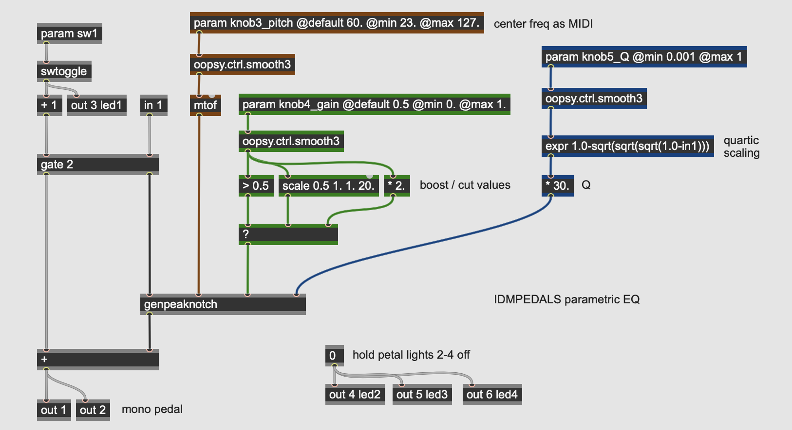</a>

This pedal consists of a three-parameter, single band *parametric equalizer*. Invented by [Burgess Macneal](https://en.wikipedia.org/wiki/Burgess_Macneal) in the mid-1960s, parametric equalizers allow for the independent control of the three main parameters of an audio filter: the center frequency, the gain (boost or cut), and the filter's [Q](https://en.wikipedia.org/wiki/Q_factor) or quality factor, expressed as a ratio of the center frequency over its bandwidth. Parametric equalizers are often used in mixing boards (especially ones with "British" equalization), as well as independent outboard processing units.

Looking at the main **gen~** patcher for the effect, the three parameters (assigned to the **param** operators) come into the patch, after some smoothing and scaling, send values into the **genpeaknotch** subpatch.

* **knob3_pitch** controls the center frequency of the filter; as with the lowpass example above, its value is initiatlly expressed as a MIDI pitch as an easy way to get pitch-linear scaling on the knob control. After smoothing with an **oopsy.ctrl.smooth3** abstraction, it is converted to frequency with the **mtof** operator.
* **knob4_gain** controls the boost or cut of the filter. The knob brings in a value from 0.0 to 1.0 which is then sent into a **?** operator, which works as a [ternary conditional](https://en.wikipedia.org/wiki/Ternary_conditional_operator) (*if - then - else*) statement. If the value at the left inlet evaluates as true (i.e. non-zero), the second inlet will be passed; otherwise, the third inlet will be passed. So if the gain knob is above 0.5, the filter gain is set to a value between 1.0 and 20.0 using the **scale** operator; this results in a *boost* in the filter. If the parameter is below 0.5, the knob's value gets multiplied by 2.0, outputting a value between 0.0 and 1.0; this results in a *cut* in the filter.
* **knob5_Q** controls the filter "quality factor", which expresses the width of the filter. A filter with a Q of 1.0 has a bandwidth equal to its center frequency; higher Q values narrow the bandwidth relative to the center frequency, and values less than 1.0 mean that the filter bandwidth is wider than the center frequency. The Q parameter here is in the range of 0.03 (*very wide*) to 30.0 (a very tight filter - 1/30th of the center frequency). The parameter knob comes into the patcher in the range of 0.001 to 1., which after smoothing is then put through a *quartic scaling* expression. This expression operator keeps the range of the parameter but changes its curvature, resulting in much more fine control at the upper range of the parameter. This value is then multiplied by 30.0 to yield the final Q parameter.

<a href="https://raw.githubusercontent.com/IDMNYU/IDMPEDALS/main/docs/img/genpeaknotch.png" target="_new"></a>

The **peaknotch** subpatch takes the audio signal and the three parameters from the pedal's knobs (center frequency, gain, and Q) and calculates the coefficients for a [biquadratic filter](https://en.wikipedia.org/wiki/Digital_biquad_filter) that does that actual processing on the signal. It does this using a **codebox** with GenExpr code, running the following calculations:

```
y[n] = ax[n] + bx[n-1] + cx[n-2] - dy[n-1] - ey[n-2]
where...
x = the input signal
y = the output signal
n = time (n is now, n-1 is one sample ago, etc.)
Fc = cutoff frequency
G = gain
Q = quality factor
SR = sampling rate

Ω = Fc * 2π/SR (sampling increment)
alpha = sin(Ω) * 0.5/Q

A = sqrt(G)
B = 1./(1. + alpha*1.0/A)

a = (1. + alpha*A) * B
b = c = (-2. * cos(Ω)) * B
d = (1. - alpha*A) * B
e = (1. - alpha*1.0/A) * B
```

The outputs of the **codebox** are the five biquad coefficients. 

<a href="https://raw.githubusercontent.com/IDMNYU/IDMPEDALS/main/docs/img/genbiquad.png" target="_new"></a>

The **genbiquad** subpatch implements the biquadratic filter equation on the input audio stream (**in 1**) using the five coefficients calculated by the **codebox** in the parent patcher. The nested **history** and arithmetic operators perform the calculations.

Parametric equalizers have advantages over fixed-band equalizers (such as found in [graphic equalizers](https://en.wikipedia.org/wiki/Equalization_(audio)#Graphic_equalizer)) insofar as they allow you to sweep and tune the filter to the specific frequency you like. This allows you to, e.g. notch out a specific resonance in the input signal or emphasize a specific range of frequencies by ear.

### EQ Xover

<a href="https://raw.githubusercontent.com/IDMNYU/IDMPEDALS/main/docs/img/Xover.png" target="_new"></a>

This pedal demonstrates how to implement a [crossover filter](https://en.wikipedia.org/wiki/Audio_crossover) as a stereo output on a pedal. Crossovers are important utility filters in signal processing, as they allow you to process different frequency bands independently and then recombine them later. This particular crossover filter has no parameters at all - it works with a fixed crossover frequency of 150 Hz, with frequencies *below* the cutoff going to the first output and frequencies *above* the cutoff going to the second output.

This **gen~** patcher also demonstrates how to do signal processing completely *within* a **codebox**, using GenExpr code adapted from Tim Place's [crossover filter design tutorial](https://cycling74.com/tutorials/crossover-filter-design-video-tutorial). All of the **gen~** operators are available within the GenExpr language, including a **History** data type which can be declared at the top to allocate memory.

The crossover algorithm used in this pedal is a [Linkwitz-Riley crossover](https://en.wikipedia.org/wiki/Linkwitz%E2%80%93Riley_filter) - a 4th-order filter which creates a sharp (but low-ripple) division between frequencies on either side of the center frequency. It uses both feedforward and feedback delay stages (for both the low and high outputs), making it an infinite impulse response (or *IIR*) filter.

*Hint: when working with the Electrosmith Daisy as a target for **gen~** patches, you sometimes need to accommodate for the fact that the Daisy microcontroller is a 32-bit architecture, as opposed to a 64-bit general computing platform such as a Mac or Windows desktop machine. In the case of this patch, you can see the **frac** variable at the top, which is used at the bottom as a divider for all the coefficients. This allows the coefficients to be written six decimal points higher than usual, giving the internal calculations a higher degree of accuracy in the 32-bit floating-point range.*

### EQ Xover2

<a href="https://raw.githubusercontent.com/IDMNYU/IDMPEDALS/main/docs/img/Xover2.png" target="_new"></a>

This pedal expands on the previous one, adding a single parameter for the crossover frequency. As with the lowpass and parametric EQ pedals, this algorithm uses MIDI scaling for the knob control, smoothing and converting it before sending it into the **genxover** subpatch:

<a href="https://raw.githubusercontent.com/IDMNYU/IDMPEDALS/main/docs/img/genxover.gendsp.png" target="_new"></a>

This subpatch contains a **codebox** with GenExpr code to calculate and perform the crossover on the input signal. The  algorithm, written by Tim Place in his [crossover filter design tutorial](https://cycling74.com/tutorials/crossover-filter-design-video-tutorial), implements a [Linkwitz-Riley crossover](https://en.wikipedia.org/wiki/Linkwitz%E2%80%93Riley_filter) filter with a variable crossover frequency, so there is significantly more code in this GenExpr than the one above - this is because the filter coefficients need to be calculated on the fly in response to the crossover frequency parameter, which could change at any time.

### EQ Wah

<a href="https://raw.githubusercontent.com/IDMNYU/IDMPEDALS/main/docs/img/Wah.png" target="_new"></a>

This pedal is a [wah-wah](https://en.wikipedia.org/wiki/Wah-wah_pedal) algorithm where the position of the filter is controlled not by an expression pedal but by the amplitude of the input signal, via an [envelope follower](https://en.wikipedia.org/wiki/Envelope_detector). This technique was first used to great acclaim in the 1972 [Mu-Tron III](https://en.wikipedia.org/wiki/Mu-Tron_III) envelope filter.

The algorithm in this pedal has four parameters:
* **knob3_base** sets the fundamental (bottom) frequency of the wah effect, brought in as a value from 0.0 to 0.8; this maps to 0% to 80% of the range of the filter, later scaled to MIDI.
* **knob4_range** sets the range of the input signal's amplitude on the wah, ranging from very subtle to covering the entire range of the filter.
* **knob5_slew** sets the attack/release characteristics of the envelope follower algorithm, with a low value causing the envelope to closely track the input signal, and a high value generating a smoother - but less responsive - control value.
* **knob6_res** sets the resonance of the wah itself, with higher values creating a stronger peak at the cutoff frequency.

The envelope follower algorithm in the pedal follows the path colored blue in the patcher: it takes the input signal, rectifies it with the **abs** operator to set the values positive, and then *lowpasses* the signal using the **slide** operator. The second and third inlets of the **slide** operator control the denominator of the filter in the rising and falling direction, respectively, with higher values making smoother output values; the values for the operator are controlled by **knob5_slew**. This rectified and lowpassed value is then scaled up, clipped in the range of 0.0 to 1.0, and finally transformed into an exponential signal using a **sqrt** operator. This value is the final envelope signal.

Once the input signal's envelope is calculated, the value is multipled by **knob4_range** and offset by **knob3_base** to generate a signal that controls the cutoff frequency of the wah. It also illuminates **led2** on the Daisy Petal board. Before going into the **genlores** subpatch, this value is converted to frequency by scaling the value to a MIDI range and then to Hertz using the **mtof** operator.

<a href="https://raw.githubusercontent.com/IDMNYU/IDMPEDALS/main/docs/img/genlores.gendsp.png" target="_new"></a>

The actual wah effect in this pedal consists of a 2nd order, resonant lowpass filter solved by the calculation in the **genlores** subpatch pictured above:

```
y[n] = ax[n] - by[n-1] - cy[n-2]
where...
x = the input signal
y = the output signal
n = time (n is now, n-1 is one sample ago, etc.)
Fc = cutoff frequency
R = resonance value
SR = sampling rate

Ω = Fc*2π/SR (sampling increment)
G = e^R*0.125 * 0.882497 (resonant coefficient)

c = G*G
b = -2.0*cos(Ω)*G
a = 1.0 + b + c
```

As with the Mu-Tron III that inspired this design, this pedal will respond the the dynamic range of the input instrument by opening the filter on louder notes. The different controls allow you to fine tune both the range and resonance characteristics of the wah itself as well as - just as importantly - the slew of the envelope follower. The original Mu-Tron pedals used a [Vactrol](https://en.wikipedia.org/wiki/Resistive_opto-isolator) with its characteristic response curve to couple the envelope follower to the filter; the photoresistor replaced the potentiometer that would have been attached to the rocker pedal on a conventional wah.

### EQ Wah2

<a href="https://raw.githubusercontent.com/IDMNYU/IDMPEDALS/main/docs/img/Wah2.png" target="_new">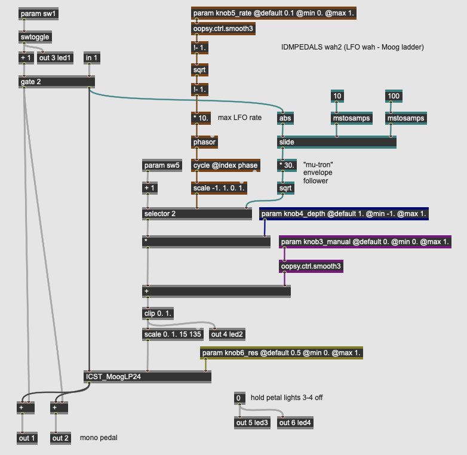</a>

This pedal uses the same premise as the last - a [wah-wah](https://en.wikipedia.org/wiki/Wah-wah_pedal) controlled by something other than a rocker pedal, and builds it out so that the wah frequency can be controlled by an [low frequency oscillator](https://en.wikipedia.org/wiki/Low-frequency_oscillation) (LFO). It also has a (simplified) version of the Mu-Tron-style envelope follower in the previous pedal that can be activated with a switch. The filter in this pedal is more complex as well: instead of a 2nd order lowpass filter, the filter is Peter McCulloch's [implementation](https://cycling74.com/tools/pm-ladder-moog-ladder-filter) of the [Moog Ladder Filter](https://www.uaudio.com/blog/moog-ladder-filter/).

Like the Mu-Tron-style wah, this pedal has four parameters:
* **knob3_manual** sets the center frequency of the wah effect, brought in as a value from 0.0 to 1.; the LFO then oscillates above this setting; when the LFO depth is set to 0.0 the filter will be fixed at this so-called *manual* value.
* **knob4_depthe** sets the amplitude of the LFO, which is then added in to the *manual* setting.
* **knob5_rate** sets the rate of the LFO from 1 to 10 Hertz. The input knob outputs values from 0.1 to 1. which are put through an exponential scaling function by inverting the value, taking its square root, and then inverting it again. This gives more control bandwidth to the lower (slower) values.
* **knob6_res** sets the resonance of the wah itself, with higher values creating a stronger peak at the cutoff frequency.

Finally, the pedal design uses a toggle switch (**param sw5**) to disengage the LFO via the **selector** operator and use a simplified [envelope follower](https://en.wikipedia.org/wiki/Envelope_detector) from the previous pedal (colored in green in the patcher) to create an envelope filter effect.

The LFO is a [sine wave](https://en.wikipedia.org/wiki/Sine_wave) oscillator generated by a **cycle** operator set in *phase* index mode, which allows it to be driven directly by a **phasor** operator. This **phasor** generates the core LFO based on the smoothed and scaled output of **knob5_rate**. The sine wave is mapped to the range of 0 to 1. The **selector** operator (controled by **sw5**) switches between the LFO output and the envelope follower, which uses a **slide** operator to smooth the absolute value of the input signal.

The output of the LFO / envelope follower is then amplified with the *depth* parameter and offset with the *manual* parameter. This final signal controls the cutoff frequency of the wah. It also illuminates **led2** on the Daisy Petal board. Before going into the **ICST_MoogLP24** subpatch, this value is converted to frequency by scaling the value to a MIDI range.

<a href="https://raw.githubusercontent.com/IDMNYU/IDMPEDALS/main/docs/img/ICST_MoogLP24.gendsp.png" target="_new">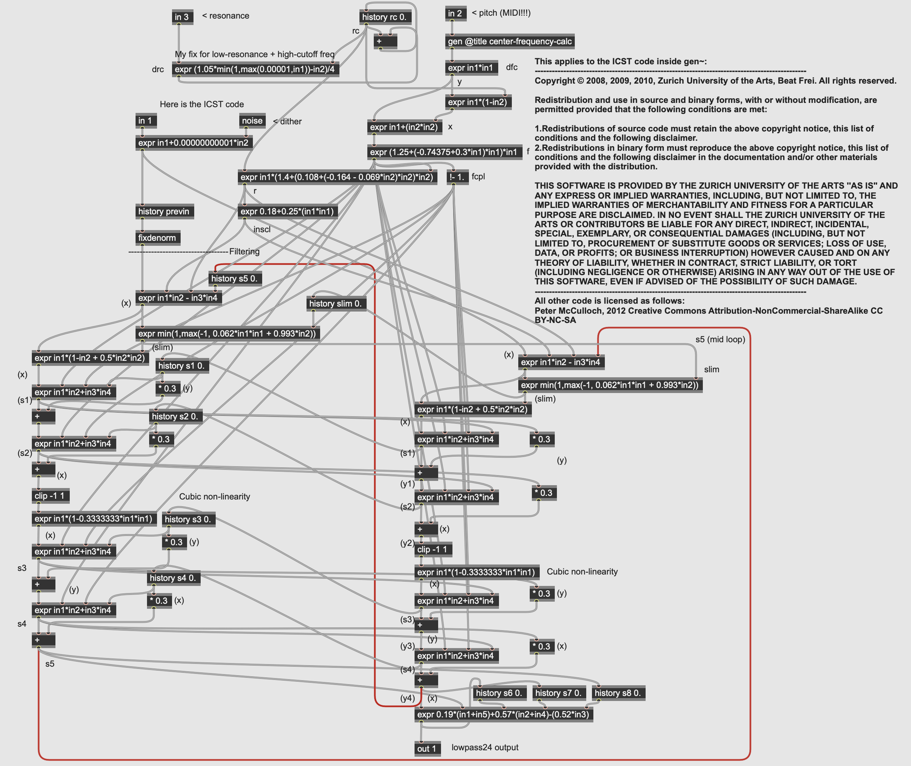</a>

The **ICST_MoogLP24** subpatch implements a digital model of the classic 4-pole resonant low-pass "Ladder Filder" developed by Robert Moog for his synthesizers. This filter has a 24dB roll-off and can resonate to the point of self-oscillation. One thing of note is that the filter module is modelled even to the point of using Moog's [1V / Octave scaling](https://en.wikipedia.org/wiki/CV/gate) to represent frequency; as a result, the incoming pitch value is converted into this range using the **center-frequency-calc** subpatcher:

<a href="https://raw.githubusercontent.com/IDMNYU/IDMPEDALS/main/docs/img/center-frequency-calc.png" target="_new">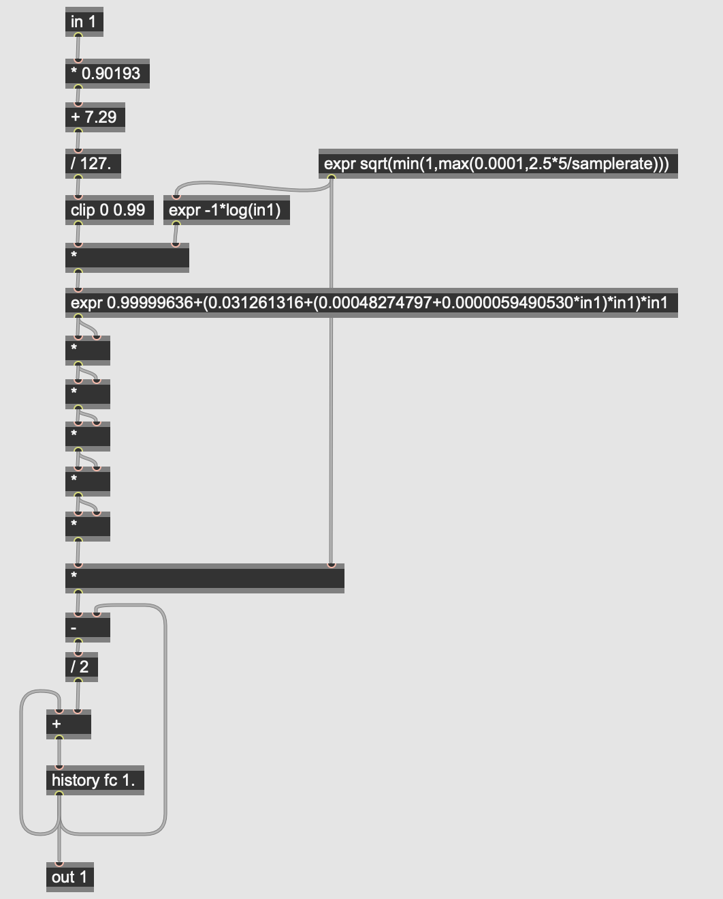</a>

[Auto-wah](https://en.wikipedia.org/wiki/Auto-wah) effects - where the filter is controlled by the input signal's envelope or by an LFO, are common effects, and the underlying algorithms for designing the envelope followers and oscillators can be used with many other types of processing.

### EQ Formant

<a href="https://raw.githubusercontent.com/IDMNYU/IDMPEDALS/main/docs/img/Formant.png" target="_new"></a>

This pedal implements a filter that simulates the [formants](https://en.wikipedia.org/wiki/Formant) of the human vocal tract. Unlike a conventional filter effect where the key aspect of the filter is its center or cutoff frequency, a formant filter contains an array of values that represent different [vowel](https://en.wikipedia.org/wiki/Vowel) sounds, using three resonant [bandpass filters](https://en.wikipedia.org/wiki/Band-pass_filter). These vowels are then scanned as a continuum that can be indexed either by an [low frequency oscillator](https://en.wikipedia.org/wiki/Low-frequency_oscillation) or an [envelope follower](https://en.wikipedia.org/wiki/Envelope_detector), as per the previous pedals.

The control parameters for the formant filter pedal are similar to the auto-wah:
* **knob3_manual** sets the center *formant* of the filter effect, brought in as a value from 0.0 to 1.; the LFO then oscillates above this setting; when the LFO depth is set to 0.0 the filter will be fixed at this so-called *manual* formant.
* **knob4_depth** sets the amplitude of the LFO, which is then added in as a bipolar signal to the *manual* setting.
* **knob5_ratethresh** sets both the rate of the LFO from 1 to 5 Hertz, and the threshold for the envelope follower to trigger a new formant. Unlike the previous two filter examples where the envelope of the input signal *sweeps* the filter range, here a threshold value triggers a new *random* formant using the **noise** and **sah** ([sample-and-hold](https://en.wikipedia.org/wiki/Sample_and_hold)) operators; every time the input signal rises above the threshold value set by this knob, a new random control value will change the sound of the filter.
* **knob6_res** sets the resonance of the formant filter itself as a [Q](https://en.wikipedia.org/wiki/Q_factor) (quality) factor, with higher value resulting in a narrower bandpass effect.
* **sw5** selects between the LFO and the envelope follower as the control source for the formant filter.

The formant filter differs from the other filter effects we've looked at: rather than the LFO or envelope driving a scaled value that serves as the filter's frequency, this filter uses a simple database of formant frequencies stored into a **data** operator in the **gen~** patcher. The **data** operator in **gen~*** works in a manner similar to the **buffer~** object in Max/MSP - it can store an arbitrary set of numerical values across a number of channels. In this case, the operator in the patcher **data formant 10 3** declares a dataset in memory labelled "formant" that will have 10 indices with three values (stored in what are called *channels*) stored at each index. This is akin to a 2-dimensional, 10-value array in a programming language where each value in the array is itself an array of length 3.

The **codebox** on the right of the patcher initializes all the values in the "formant" **data** operator. The **poke** command in GenExpr sets triplets of values into the channels. Each index in "formant" consists of the three fundamendal frequencies for a vowel in the English language.

Once the dataset we want to work with is stored into the **data** operator, it can be read and used in the algorithm. The **sample** operator (colored in blue) indexes the "format" **data** using the LFO/envelope values from 0.0 to 1.0 - a value of 0.0 will output the first indexed values; a value of 10.0 will output the last indexed values, and numbers in between will interpolate between the rest of the data. The **sample** operator is multi-channel, so all three of the formant filters can be driven with one **sample**. These frequencies (along with the input signal and the **param knob6_res** parameter then go into three paralel **genreson** subpatches that perform the filtering on the input signal:

<a href="https://raw.githubusercontent.com/IDMNYU/IDMPEDALS/main/docs/img/genreson.gendsp.png" target="_new"></a>

This subpatch implements a 2nd order resonant bandpass filter, equivalent to the **reson~** object in Max/MSP:

```
y[n] = ax[n] + bx[n-2] + cy[n-1] + dy[n-2]
where...
x = the input signal
y = the output signal
n = time (n is now, n-1 is one sample ago, etc.)
Fc = center frequency
Q = resonance value (Q factor)
SR = sampling rate

bw = Fc/Q (bandwidth)
r = e^-bw*2π/SR (sampling increment)

a = 1-r
b = (1-r)*r
c = 2*r*cos(Fc*2π/SR)
d = -r*r
```

The three **reson** filters, when run in parallel, simulate the resonances of the human mouth when forming basic vowel sounds - roughly speaking, each filter is responsible for the mouth's width, heigh, and depth. The resulting effect sounds less like a wah-wah and more like a [talk box](https://en.wikipedia.org/wiki/Talk_box). Formant filtering can be used for many applications, from vocal effects to simulating the resonances of instrument bodies (c.f. the [Boss "Acoustic Simulator"](https://www.boss.info/us/products/ac-3/) pedal).

### EQ Vocoder

<a href="https://raw.githubusercontent.com/IDMNYU/IDMPEDALS/main/docs/img/Vocoder.png" target="_new"></a>

This pedal implements a [Vocoder](https://en.wikipedia.org/wiki/Vocoder). Vocoders were originally developed as a mechanism for low-bandwidth (and secure) encoding of speech as parallel streams of envelopes (DC voltages) that could be transmitted and resynthesized at their destination. These devices became used creatively by composers and musicians so that by the 1970s vocoders were being manufactured (by Moog, Roland, and others) exclusively for use as a musical *cross-synthesizer*, allowing two audio sources to be blended, with one source providing the tonal characteristics and the other providing the articulation and timbre. 

The patcher used here implements a vocoder based on the [1978 16-channel Moog Vocoder]. It uses two inputs, with input 1 serving as the *carrier* (typically a tonal input such as a synthesizer) and input 2 serving as the *program* (typically an input with a rich, articulated spectrum such as voice). The effect works by filtering both inputs using a [bank of bandpass filters](https://en.wikipedia.org/wiki/Filter_bank); it then puts the output of each of the *program*'s filter channels through an envelope follower; these envelope characteristics are then used, channel-by-channel, to control the gain of the equivalent frequency band in the *carrier* sound. The result is a synthesizer than can sound like its talking, for example.

Our vocoder effect has three parameters and one switch used to control the effect:
* **knob3_res** controls the Q of the filters in both sides of the vocoder; the higher the Q, the more focused both the analysis (*program*) and synthesis (*carrier*) channels will be on the center frequencies of the 16 filter bands used in the effect.
* **knob4_gain** controls the volume (gain) of the *carrier* input.
* **knob5_noise** controls a white noise signal that can be mixed in with the *carrier* to give it more spectral density. A high amount of noise will make the vocoder sound raspier and more voice-like.
* **sw2** is a momentary "hold" switch will *freeze* the envelope states of the *program* signal. This allows you to, e.g. sing a vowel and sustain it as the filter effect with a footswitch.

The vocoder algorithm take the *carrier* (**in 1**, mixed with noise based on **knob5_noise**) and the *program* (**in 2**) and sends both signals (along with parameter information) into sixteen parallel instances of the **vocoderchannel** subpatch. These subpatches are identical but receive different center frequency settings at their second inlets.

<a href="https://raw.githubusercontent.com/IDMNYU/IDMPEDALS/main/docs/img/vocoderchannel.gendsp.png" target="_new"></a>

The sixteen individual **vocoderchannel** subpatchers perform three tasks:

* *filter* both the *carrier* and *program* inputs based on the center frequency and Q sent in from the parent patcher. The frequencies are based on the 1978 Moog specification and are different for each subpatcher; the Q is set by **knob3_res**. The algorithm for the filter is a 2nd order resonant bandpass (**genreson**, the same as used in the formant filter example).
* an *envelope follower* is applied to the *program* signal, with **abs** and **slide** operators generating a positive envelope signal for each filter channel of the *program*. This value can be sustained by **sw2**, which connects to the **latch** operator to hold a constant value.
* a multiplier that takes the filtered audio of the *carrier* signal and multiplies it by the envelope derived from the filtered *program* signal. This, happening across sixteen parallel bands, is the heart of the vocoder effect. The **dcblock** operator removes any unwanted [sub-audio signal](https://en.wikipedia.org/wiki/DC_bias) from each channel.

The sixteen outputs of the **vocoderchannel** are then summed to the output of the pedal.

<a href="https://raw.githubusercontent.com/IDMNYU/IDMPEDALS/main/docs/img/genreson.gendsp.png" target="_new"></a>

As with the formant filter, the vocoder channels implement a 2nd order resonant bandpass filter, equivalent to the **reson~** object in Max/MSP:

```
y[n] = ax[n] + bx[n-2] + cy[n-1] + dy[n-2]
where...
x = the input signal
y = the output signal
n = time (n is now, n-1 is one sample ago, etc.)
Fc = center frequency
Q = resonance value (Q factor)
SR = sampling rate

bw = Fc/Q (bandwidth)
r = e^-bw*2π/SR (sampling increment)

a = 1-r
b = (1-r)*r
c = 2*r*cos(Fc*2π/SR)
d = -r*r
```

The vocoder is an interesting hybrid processor, using a filter bank not for traditional equalization, but as a multi-band dynamics processor where a second signal controls the gain on each channel. In the next section, we consider *dynamics* effects, many of which use this technique for different common effects in music production.

## Dynamics

Dynamics effects work by changing the *gain* of the input signal. Dynamics-based processing techniques, like equalization, are central to audio production, and effects such as *compression*, *limiting*, and *noise gates* are used in live sound reinforcement, broadcast engineering, recording, and mastering, as tools to help create consistent output levels, prevent sudden signal spikes, reduce noise, and generally improve signal quality. Generally, one important common factor in dynamics processing is the generatino of a *key* signal, usually via an envelope follower; this signal gives the rest of the circuit an understanding of the overall volume of the input, which then influences how the real signal is attenuated or amplified. In pedal design, dynamics processors are often first in the effects chain to provide *compression* on the instrument signal, levelling its dynamic range, or *gating* to reduce noise. With these algorithms, creative effects are possible, often by using sidechain inputs for the key signal.

### Dyn Tremolo

<a href="https://raw.githubusercontent.com/IDMNYU/IDMPEDALS/main/docs/img/Tremolo.png" target="_new">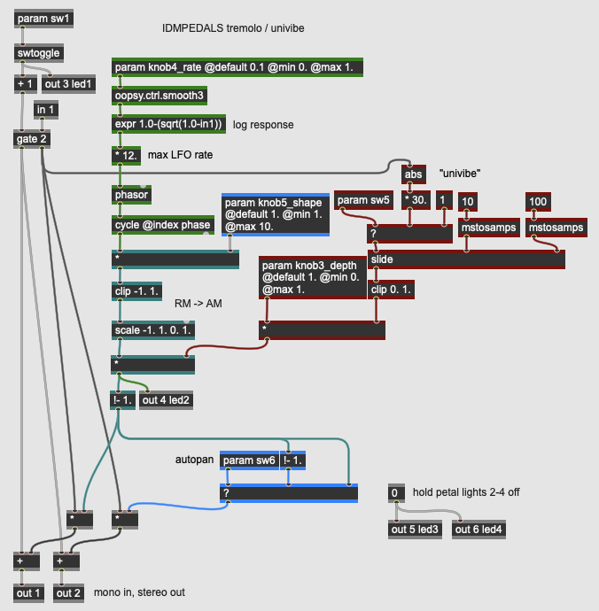</a>

This pedal implements one of the oldest dynamics-related effects: a periodic fading-in and fading-out of the signal through [amplitude modulation](https://en.wikipedia.org/wiki/Amplitude_modulation) that creates an effect akin to musical [**tremolo**](https://en.wikipedia.org/wiki/Tremolo). The tremolo effect uses a [low frequency oscillator](https://en.wikipedia.org/wiki/Low-frequency_oscillation) (LFO), which can be shaped from a sine wave to a near-[square wave](https://en.wikipedia.org/wiki/Square_wave). The effect has a switch that allows the intensity (*depth*) of the effect to be controlled with by a constant knob value or by the amplitude of the input signal; this latter technique is inspired by the classic [Uni-Vibe](https://en.wikipedia.org/wiki/Uni-Vibe) pedals from the 1960s. Finally, this pedal has a [stereo output](https://en.wikipedia.org/wiki/Stereophonic_sound), allowing it to be used as an [auto-panner](https://en.wikipedia.org/wiki/Panning_(audio)).

The pedal has three knob controls as well as two switches that control its configuration:
* **knob3_depth** sets the manual intensity of the tremolo effect when **sw5** is disengaged. When turned all the way up, the input signal will be completely attenuated when the LFO is at its lowest point.
* **knob4_rate** sets the speed of the LFO up to 12 Hz; the knob has a logarithmic response through the use of the **expr** operator.
* **knob5_shape** alters the waveform of the LFO by amplifying it into a clipping circuit. This allows the shape of the tremolo to range from a smooth sine wave to an extreme *in/out* shape by making the LFO close to a square wave.
* **sw5** selects between **knob3_depth** and the [envelope follower](https://en.wikipedia.org/wiki/Envelope_detector) as the intensity control of the LFO.
* **sw6** engages an *auto-panning* effect where the LFO is inverted at the right output; with this setting engaged, the pedal has a stereo output where the gain of the signal in the left channel will be the opposite of the right.

As with the Wah effects above, this effect uses both an LFO and, optionally, an envelope follower to adjust the actual effect, which is simply a gain control using a <b>*</b> operator. The LFO is a **cycle** operator driven by a **phasor** that can be shaped through a gain stage into a **clip** operator; this shapes the waveform according to **knob5_shape**. The envelope follower takes the input signal and converts it into a smooth representation of the input gain using the **abs** and **slide** operators. The intensity of the tremolo effect illuminates **led2** on the Daisy Petal board.

Tremolo effects are among the oldest special effects for instruments, with [tremulant](https://en.wikipedia.org/wiki/Tremulant) effects on organs as far back as the 18th Century.

### Dyn Compressor

<a href="https://raw.githubusercontent.com/IDMNYU/IDMPEDALS/main/docs/img/Compressor.png" target="_new"></a>

The pedal implements a digital [compressor / limiter](https://en.wikipedia.org/wiki/Dynamic_range_compression), where an input signal exceeding a threshold value is attenuated either by a fixed ratio (**compression**) or by a very high ratio guaranteed to keep the audio within a specific dynamic range (**limiting**). Compressors and limiters, in addition to their threshold and ratio settings, also have controls around how quickly the compression takes effect when the threshold is exceeded (the **attack** time) and how quickly the compression relaxes once the input signal goes below the threshold (the **release** time); in practice, both of these parameters are controlling aspects of the [envelope follower](https://en.wikipedia.org/wiki/Envelope_detector) that generates the *key signal* for the dynamics processor. Finally, most compressor / limiters allow the user to adjust both the input gain into the circuit and the output level (sometimes called *makeup gain*).

This particular compressor / limiter is inspired by the tune4media lesson on compression using **gen~** found [here](https://www.youtube.com/watch?v=ObBldvarun0&ab_channel=tune4media).

In light of all these parameters, our compressor pedal has six dynamic controls and one switch:
* **knob1_input** sets the level of the input signal into the compression circuit; this allows us to fine tune the compressor to work with a wide range of instrument inputs. This value range is in [decibels](https://en.wikipedia.org/wiki/Decibel), with the eventual value converted to linear amplitude using the **dbtoa** operator.
* **knob2_output** sets the output of the pedal, post-effect, in the same manner as the **knob1_input**. Compression circuits often refer to this parameter as the *makeup gain* of the circuit, as the compressor itself only *reduces* the volume. This allows you to get a *louder* overall signal by compressing the input and then boosting the overall output.
* **knob3_threshold** sets the level at which the compressor / limiter engages. It does this by comparing its value against the output of the input signal's envelope follower. To maintain a logarithmic response, all of these calculations occur in decibels.
* **knob4_ratio** sets the *amount* of compression applied to the signal as it rises above the *threshold*; a ratio of 1:1 means no compression; a ratio of 2:1 means that the input signal needs to rise 2 decibels above the threshold for every 1 decibel of rise out of the compressor. Higher ratios cause more compression; when the limiter **sw5** is engaged, this ratio is ignored.
* **knob5_attack** sets the *attack time* (in milliseconds) for the compressor to engage; this is the rising value for the **slide** operator on the input signal's envelope follower. A fast attack will cause the compressor to engage quickly in response to fast dynamic changes.
* **knob6_release** sets the *release time* (in milliseconds) for the compressor to disengage; this is the falling value for the **slide** operator on the input signal's envelope follower. A slow release will cause the compressor to slowly relax its attenuation.
* **sw5** selects between the circuit behaving as a *compressor*, where the ratio set by **knob4_ratio** is used, and a *limiter*, where a very high (10000) ratio is used. When engaged, the input will never exceed the threshold value, creating a hard ceiling for the signal's dynamic range.

The key signal of the compressor illuminates **led2** on the Daisy Petal allowing you to see the behavior of the attack and decay settings. The compressor / limiter's calculation algorithm works by converting the envelope follower's output into a key signal expressed in decibels (via the **atodb** operator); when this value exceeds the threshold (the **>** operator), the *reducation amount* calculated by the patcher logic colored purple is engaged to create a multiplication factor on the input signal. The output level **knob2_output** then adds makeup gain to the signal allowing you to boost the compressed audio.

Compressor / limiters are fairly ubiquitous as pedal effects, particularly with instruments that have high dynamic range in their transients (e.g. electric bass guitars). They can be configured to create a transparent "levelling" of an input signal or be used more creatively to create a hard [pumping sound](https://en.wikipedia.org/wiki/Pumping_(audio)) as they engage and disengage.

### Dyn Gate

<a href="https://raw.githubusercontent.com/IDMNYU/IDMPEDALS/main/docs/img/Gate.png" target="_new"></a>

A [noise gate](https://en.wikipedia.org/wiki/Noise_gate) is a dynamics processor that is the inverse of a limiter. Instead of reducing the volume of an input signal that exceeds a threshold, the circuit reduces the volume of a signal that falls *below* a threshold. This can clean up a signal by eliminating ground hum, hiss, or other low level noise in a signal when the instrument driving the signal is silent. Noise gates, like compressors, are used extensively in audio production beyond effect pedals; their most common use is to attenuate (or *duck*) background noise in broadcast or recording scenarios where there is an open mic.

Our noise gate pedal has the same core architecture as the compressor / limiter pedal, with one key component (the comparator operator) changed. There are five dynamic controls as well as a switch that engages the second input to the pdeal as a [sidechain](https://en.wikipedia.org/wiki/Dynamic_range_compression#Side-chaining):
* **knob1_input** sets the level of the input signal into the gate circuit; this allows us to fine tune the gate to work with a wide range of instrument inputs. This value range is in [decibels](https://en.wikipedia.org/wiki/Decibel), with the eventual value converted to linear amplitude using the **dbtoa** operator.
* **knob2_output** sets the output of the pedal, post-effect, in the same manner as the **knob1_input**. Dynamics circuits often refer to this parameter as the *makeup gain*.
* **knob3_threshold** sets the level at which the gate engages. It does this by comparing its value against the output of the input signal's envelope follower. To maintain a logarithmic response, all of these calculations occur in decibels.
* **knob4_attack** sets the *attack time* (in milliseconds) for the gate; this is the rising value for the **slide** operator on the key signal's [envelope follower](https://en.wikipedia.org/wiki/Envelope_detector). A fast attack will cause the gate to duck quickly in response to a note stopping, for example.
* **knob5_release** sets the *release time* (in milliseconds) for the gate; this is the falling value for the **slide** operator on the key signal's envelope follower. A slow release will cause the ducking effect to slowly fade the input signal back in.
* **sw5** selects between the gate listening to the input signal or to a *sidechain* input at **in2** as its key signal; when a sidechain is activated, the gate can be used creatively to, e.g. duck a sustained instrument input based on a drum track.

The key signal's envelope illuminates **led2** on the Daisy Petal allowing you to see the behavior of the attack and decay settings. The gate's calculation algorithm works by converting the envelope follower's output into a key signal expressed in decibels (via the **atodb** operator); when this value falls below the threshold (the **<** operator), the *reducation amount* calculated by the patcher logic colored purple is engaged to create a multiplication factor on the input signal; this will attenuate quiet signals to 0 when the gate fully engages. The output level **knob2_output** then adds makeup gain to the signal allowing you to boost the compressed audio.

Noise gates are used as pedal effects to help attenuate electrical hum (e.g. from a single-coil guitar pickup) and other unwanted sounds when an instrument goes quiet; they are also used with sidechain inputs to add rhythmic effects to a sound.

## Distortion

[Distortion](https://en.wikipedia.org/wiki/Distortion_(music)) effects are some of the most iconic signal processing techniques used in audio, and some of the earliest effect pedals fall into this category. Like dynamics effects, distortion effects are mathematically adjusting the amplitude of an audio signal; however, unlike dynamics effects, where the objective is to control the sound's dynamic range overall, distortion effects directly alter the sound wave of the input signal through techniques such as [clipping](https://en.wikipedia.org/wiki/Clipping_(audio)), [waveshaping](https://en.wikipedia.org/wiki/Waveshaper), and other mathematical algorithms that simulate the characteristics of amplification equipment being fed a hot signal, pushed beyond their recommended power output, or intentionally damaged. Modern distortion effects depart from the historical categories of fuzz, overdrive, and distortion to create new sounds, all of which shape the input signal in way that its [timbre](https://en.wikipedia.org/wiki/Timbre) is transformed.

### Dist Overdrive

<a href="https://raw.githubusercontent.com/IDMNYU/IDMPEDALS/main/docs/img/Overdrive.png" target="_new"></a>

This pedal implements a simple distortion algorithm called *hard clipping*, where a signal is amplified, then input into a circuit that imposes a hard limit on its range, causing an *overdrive* effect where the waveform squares off at the edges, emphasizing and adding harmonics to the signal. Using analog circuitry, hard clipping is easily accomplished by overdriving an operational amplifier; with DSP, we can accomplish a similar effect with one parameter (**knob3_OD**) that amplifies the input signal (using a <b>*</b>) into a **clip** operator (shaping the signal), then divides the signal back down to lower the overall volume (using a <b>/</b>). The higher the overdrive factor (up to 500 in our algorithm), the more prominent the clipping effect will be.

### Dist Fuzz

<a href="https://raw.githubusercontent.com/IDMNYU/IDMPEDALS/main/docs/img/Fuzz.png" target="_new"></a>

### Dist Octavia

<a href="https://raw.githubusercontent.com/IDMNYU/IDMPEDALS/main/docs/img/Octavia.png" target="_new"></a>

### Dist Distortion

<a href="https://raw.githubusercontent.com/IDMNYU/IDMPEDALS/main/docs/img/Distortion.png" target="_new"></a>

### Dist Distortion2

<a href="https://raw.githubusercontent.com/IDMNYU/IDMPEDALS/main/docs/img/Distortion2.png" target="_new"></a>

### Dist Waveshaper

<a href="https://raw.githubusercontent.com/IDMNYU/IDMPEDALS/main/docs/img/Waveshaper.png" target="_new"></a>

### Dist Waveshaper2
    
<a href="https://raw.githubusercontent.com/IDMNYU/IDMPEDALS/main/docs/img/Waveshaper2.png" target="_new">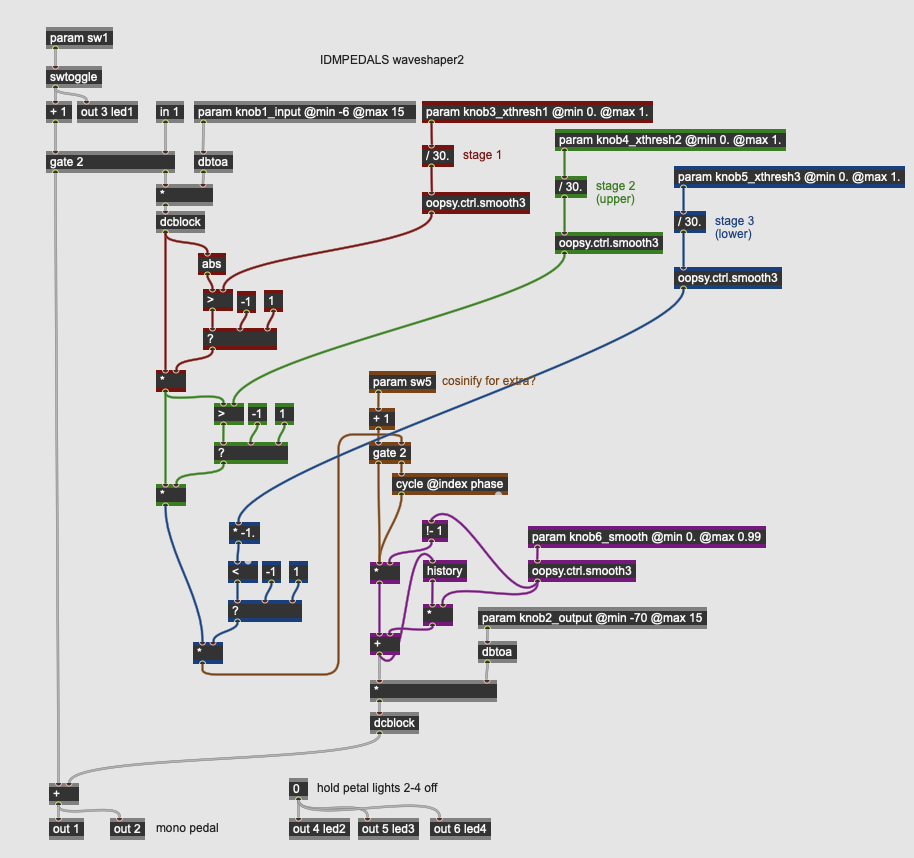</a>

## Modulation

### Mod Chorus

<a href="https://raw.githubusercontent.com/IDMNYU/IDMPEDALS/main/docs/img/Chorus.png" target="_new"></a>

### Mod Chorus2

<a href="https://raw.githubusercontent.com/IDMNYU/IDMPEDALS/main/docs/img/Chorus2.png" target="_new"></a>

### Mod Flanger

<a href="https://raw.githubusercontent.com/IDMNYU/IDMPEDALS/main/docs/img/Flanger.png" target="_new"></a>

### Mod Phaser

<a href="https://raw.githubusercontent.com/IDMNYU/IDMPEDALS/main/docs/img/Phaser.png" target="_new">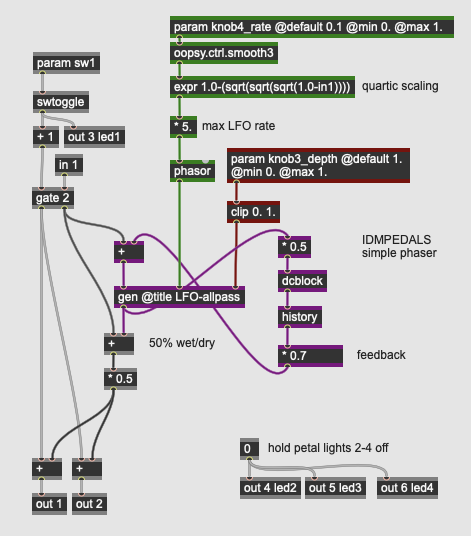</a>

### Mod Phaser2

<a href="https://raw.githubusercontent.com/IDMNYU/IDMPEDALS/main/docs/img/Phaser2.png" target="_new">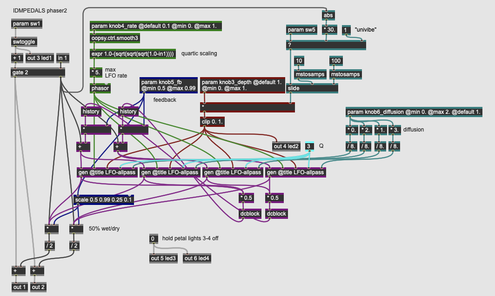</a>

### Mod Harmonizer

<a href="https://raw.githubusercontent.com/IDMNYU/IDMPEDALS/main/docs/img/Harmonizer.png" target="_new"></a>

### Mod Shcomb

<a href="https://raw.githubusercontent.com/IDMNYU/IDMPEDALS/main/docs/img/SHComb.png" target="_new"></a>

### Mod Shcomb2

<a href="https://raw.githubusercontent.com/IDMNYU/IDMPEDALS/main/docs/img/SHComb2.png" target="_new"></a>

## Delay

### Del Digitaldelay

<a href="https://raw.githubusercontent.com/IDMNYU/IDMPEDALS/main/docs/img/DigitalDelay.png" target="_new"></a>

### Del Digitaldelay2

<a href="https://raw.githubusercontent.com/IDMNYU/IDMPEDALS/main/docs/img/DigitalDelay2.png" target="_new"></a>

### Del Reverb

<a href="https://raw.githubusercontent.com/IDMNYU/IDMPEDALS/main/docs/img/Reverb.png" target="_new"></a>

### Del Reverb2

<a href="https://raw.githubusercontent.com/IDMNYU/IDMPEDALS/main/docs/img/Reverb2.png" target="_new"></a>

### Del Reverb3
    
<a href="https://raw.githubusercontent.com/IDMNYU/IDMPEDALS/main/docs/img/Reverb3.png" target="_new"></a>

## Special

### Sfx Subharmonic

<a href="https://raw.githubusercontent.com/IDMNYU/IDMPEDALS/main/docs/img/Subharmonic.png" target="_new">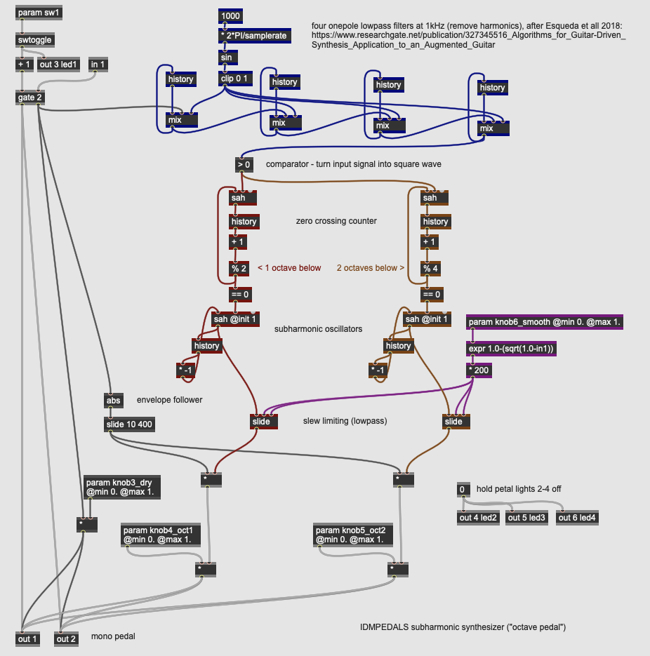</a>

### Sfx Shsine

<a href="https://raw.githubusercontent.com/IDMNYU/IDMPEDALS/main/docs/img/SHSine.png" target="_new"></a>

### Sfx Ringmod

<a href="https://raw.githubusercontent.com/IDMNYU/IDMPEDALS/main/docs/img/Ringmod.png" target="_new">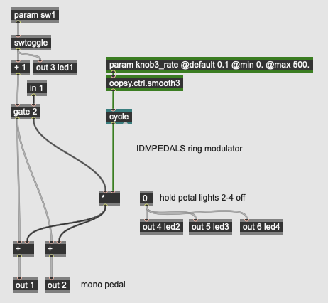</a>

### Sfx Freqshift

<a href="https://raw.githubusercontent.com/IDMNYU/IDMPEDALS/main/docs/img/FreqShiftRingMod.png" target="_new"></a>

### Sfx Fmdelay

<a href="https://raw.githubusercontent.com/IDMNYU/IDMPEDALS/main/docs/img/FMDelay.png" target="_new">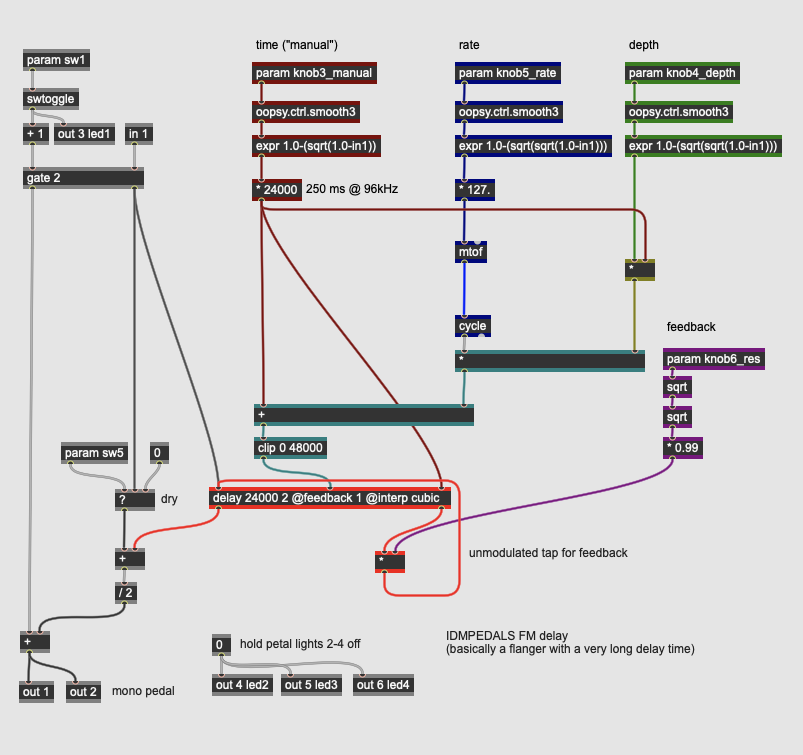</a>

### Sfx Glitch

<a href="https://raw.githubusercontent.com/IDMNYU/IDMPEDALS/main/docs/img/Glitch.png" target="_new"></a>

### Sfx Glitch2 

<a href="https://raw.githubusercontent.com/IDMNYU/IDMPEDALS/main/docs/img/Glitch2.png" target="_new">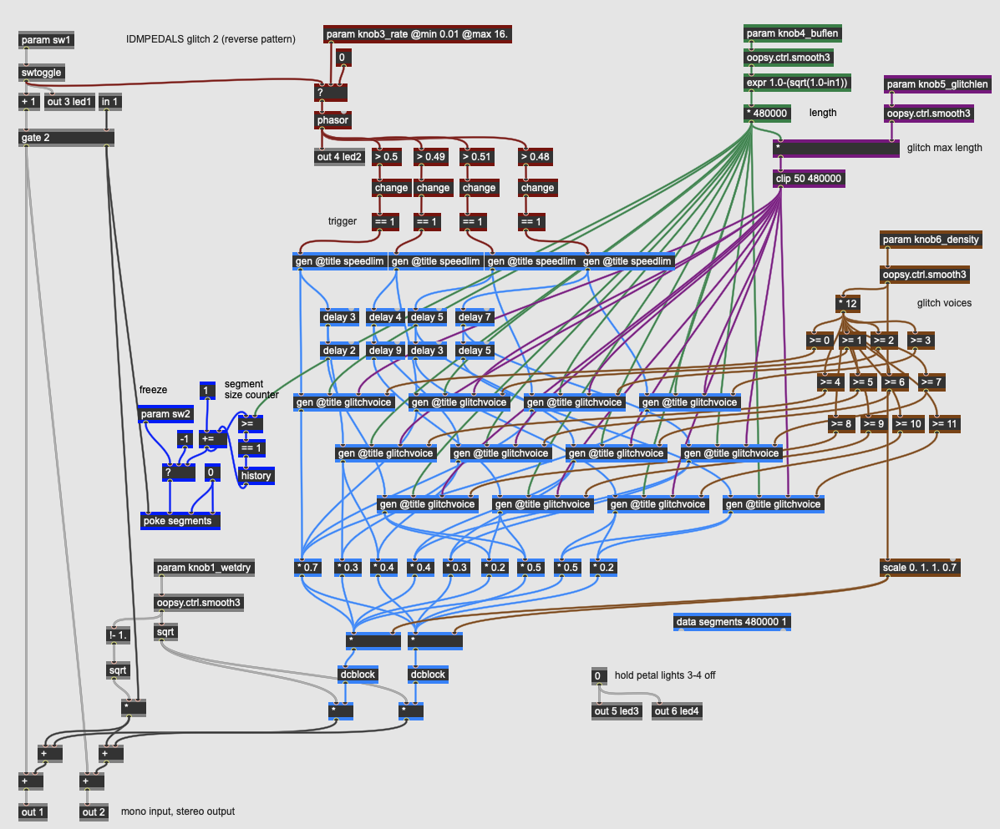</a>

### Sfx Yin

<a href="https://raw.githubusercontent.com/IDMNYU/IDMPEDALS/main/docs/img/Yin.png" target="_new"></a>

[back to top](#top)

[return to main page](./index.md)

