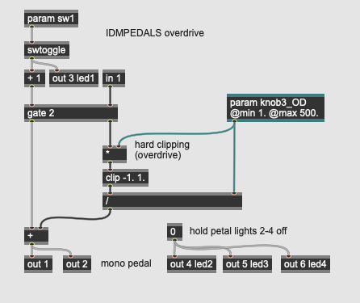
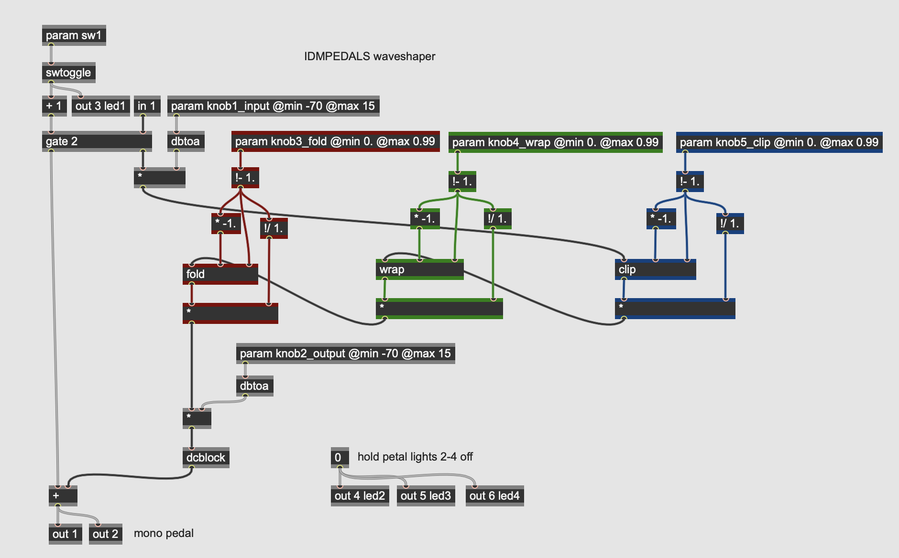
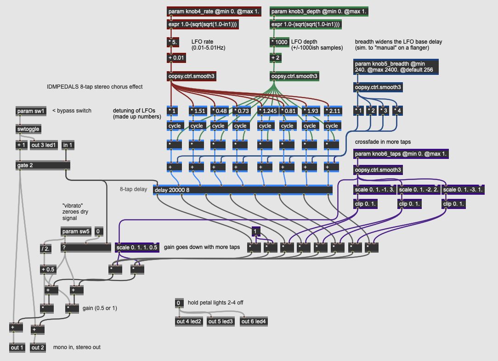
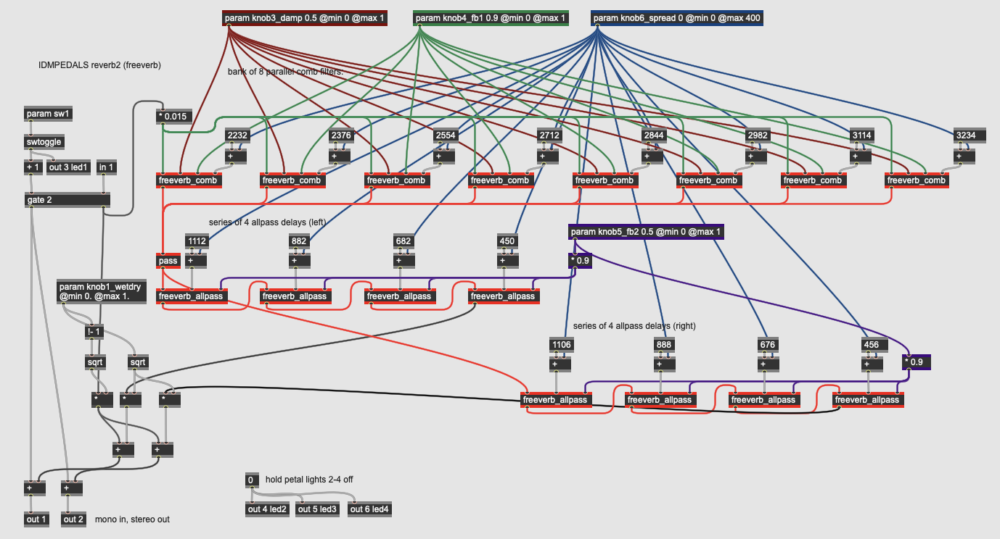

# IDM PEDALS

- [EQ](#eq)
  - [Lowpass Filter](#eq-lowpass)
  - [Parametric EQ](#eq-parametric)
  - [Fixed Crossover Filter](#eq-xover)
  - [Variable Crossover Filter](#eq-xover2)
  - [Mu-Tron Wah](#eq-wah)
  - [LFO Auto-Wah](#eq-wah2)
  - [Formant Filter](#eq-formant)
  - [Vocoder](#eq-vocoder)
- [Dynamics](#dynamics)
  - [Tremolo / Univibe](#dyn-tremolo)
  - [Compressor / Limiter](#dyn-compressor)
  - [Gate](#dyn-gate)
- [Distortion](#distortion)
  - [Overdrive](#dist-overdrive)
  - [Fuzz](#dist-fuzz)
  - [Octave Fuzz](#dist-octavia)
  - [Amp Distortion](#dist-distortion) 
  - [Crunch Distortion](#dist-distortion2) 
  - [Clipping, Folding, Wrapping](#dist-waveshaper) 
  - [Parametric Waveshaping](#dist-waveshaper2) 
- [Modulation](#modulation)
  - [Simple Chorus](#mod-chorus) 
  - [Chorus Ensemble](#mod-chorus2) 
  - [Flanger](#mod-flanger) 
  - [Simple Phaser](#mod-phaser) 
  - [Multi-stage Phaser](#mod-phaser2) 
  - [Harmonizer](#mod-harmonizer) 
  - [S&H Comb](#mod-shcomb) 
  - [Harmonic Filters](#mod-shcomb2) 
- [Delay](#delay)
  - [Digital Delay](#del-digitaldelay) 
  - [Multi-tap Delay](#del-digitaldelay2) 
  - [Chowning Reverb](#del-reverb) 
  - [Freeverb](#del-reverb2) 
  - [Creepy Reverb](#del-reverb3) 
- [Special FX](#special)
  - [Subharmonic Oscillator](#sfx-subharmonic) 
  - [Sample-and-Hold Sine](#sfx-shsine) 
  - [Ring Modulator](#sfx-ringmod) 
  - [Frequency Shifter](#sfx-freqshift) 
  - [FM Delay](#sfx-fmdelay) 
  - [Glitch Sampler](#sfx-glitch) 
  - [Reverse Sampler](#sfx-glitch2) 
  - [Yin Synthesizer](#sfx-yin) 

# Pedals

## EQ

Equalization effects are audio processors that work by adjusting different frequency bands in the input signal. These effects range from the subtle and utilitarian (e.g. a tone control which rolls off the treble) to more creative uses of equalization such as [wah-wah](https://en.wikipedia.org/wiki/Wah-wah_pedal) pedals. When working with analog or time-domain digital signals, equalization is done using [filters](https://en.wikipedia.org/wiki/Audio_filter).

### EQ Lowpass

<a href="https://raw.githubusercontent.com/IDMNYU/IDMPEDALS/main/docs/img/Lowpass.png" target="_new"></a>

This pedal implements a simple one pole [lowpass filter](https://en.wikipedia.org/wiki/Low-pass_filter) with a single knob (**param knob3**, at the top-right) controlling the [cutoff frequency]. Time-domain filters are implemented using short delays, so the **history** and *mix* operators do the actual filtering of the signal. 

The desired cutoff frequency coming from the parameter knob is intially expressed as a MIDI value in the range of 23 to 127 (30 Hz to 12.5 kHz).

*Hint: using a MIDI range as a parameter instead of frequency is a simple way to make the knob have a logarithmic frequency (or pitch linear) response; moving the knob by twelve steps, for example, will move the parameter by an octave anywhere in its range.*

After being smoothed (using the **oopsy.ctrl.smooth3** abstraction) and converted to frequency (using the **mtof** operator), the cutoff frequency is converted into the *a* coefficient for a simple first-order IIR lowpass filter:

```
y[n] = ax[n] + by[n-1]
where...
x = the input signal
y = the output signal
n = time (n is now, n-1 is one sample ago, etc.)
Fc = cutoff frequency
SR = sampling rate
Ω = Fc*2π/SR (sampling increment)
a = e^-Ω
b = 1.0-a
```

This calculation takes converts our desired cutoff frequency into a single coefficient defining *how much smoothing to apply* to the input signal by mixing it with the previous output sample from the **history** operator. 

A coefficient of 0.0 will leave the input signal unchanged, which is the equivalent of the filter cutoff frequency being equal to the Nyquist frequency - no filtering at all. By a similar token, a coefficient of 1.0 will make the filter output its previous state as direct current and include no new information - a cutoff frequency of 0 Hz. A coefficient of 0.5 will mix the incoming signal and previous output in equal amounts, resulting in a cutoff frequency of half the frequency range of the system (or a quarter of the sampling rate).

This effect is quite simple, and would be an unlikely candidate on its own for an entire effects pedal - it's much closer to the tone control circuit on an electric guitar or an EQ knob on a consumer stereo system. However, when combined with other algorithms a simple lowpass filter can be used to many creative ways.

### EQ Parametric

<a href="https://raw.githubusercontent.com/IDMNYU/IDMPEDALS/main/docs/img/Parametric.png" target="_new"></a>

This pedal consists of a three-parameter, single band *parametric equalizer*. Invented by [Burgess Macneal](https://en.wikipedia.org/wiki/Burgess_Macneal) in the mid-1960s, parametric equalizers allow for the independent control of the three main parameters of an audio filter: the center frequency, the gain (boost or cut), and the filter's [Q](https://en.wikipedia.org/wiki/Q_factor) or quality factor, expressed as a ratio of the center frequency over its bandwidth. Parametric equalizers are often used in mixing boards (especially ones with "British" equalization), as well as independent outboard processing units.

Looking at the main **gen~** patcher for the effect, the three parameters (assigned to the **param** operators) come into the patch, after some smoothing and scaling, send values into the **genpeaknotch** subpatch.

* **knob3_pitch** controls the center frequency of the filter; as with the lowpass example above, its value is initiatlly expressed as a MIDI pitch as an easy way to get pitch-linear scaling on the knob control. After smoothing with an **oopsy.ctrl.smooth3** abstraction, it is converted to frequency with the **mtof** operator.
* **knob4_gain** controls the boost or cut of the filter. The knob brings in a value from 0.0 to 1.0 which is then sent into a **?** operator, which works as a [ternary conditional](https://en.wikipedia.org/wiki/Ternary_conditional_operator) (*if - then - else*) statement. If the value at the left inlet evaluates as true (i.e. non-zero), the second inlet will be passed; otherwise, the third inlet will be passed. So if the gain knob is above 0.5, the filter gain is set to a value between 1.0 and 20.0 using the **scale** operator; this results in a *boost* in the filter. If the parameter is below 0.5, the knob's value gets multiplied by 2.0, outputting a value between 0.0 and 1.0; this results in a *cut* in the filter.
* **knob5_Q** controls the filter "quality factor", which expresses the width of the filter. A filter with a Q of 1.0 has a bandwidth equal to its center frequency; higher Q values narrow the bandwidth relative to the center frequency, and values less than 1.0 mean that the filter bandwidth is wider than the center frequency. The Q parameter here is in the range of 0.03 (*very wide*) to 30.0 (a very tight filter - 1/30th of the center frequency). The parameter knob comes into the patcher in the range of 0.001 to 1., which after smoothing is then put through a *quartic scaling* expression. This expression operator keeps the range of the parameter but changes its curvature, resulting in much more fine control at the upper range of the parameter. This value is then multiplied by 30.0 to yield the final Q parameter.

<a href="https://raw.githubusercontent.com/IDMNYU/IDMPEDALS/main/docs/img/genpeaknotch.png" target="_new"></a>

The **peaknotch** subpatch takes the audio signal and the three parameters from the pedal's knobs (center frequency, gain, and Q) and calculates the coefficients for a [biquadratic filter](https://en.wikipedia.org/wiki/Digital_biquad_filter) that does that actual processing on the signal. It does this using a **codebox** with GenExpr code, running the following calculations:

```
y[n] = ax[n] + bx[n-1] + cx[n-2] - dy[n-1] - ey[n-2]
where...
x = the input signal
y = the output signal
n = time (n is now, n-1 is one sample ago, etc.)
Fc = cutoff frequency
G = gain
Q = quality factor
SR = sampling rate

Ω = Fc * 2π/SR (sampling increment)
alpha = sin(Ω) * 0.5/Q

A = sqrt(G)
B = 1./(1. + alpha*1.0/A)

a = (1. + alpha*A) * B
b = c = (-2. * cos(Ω)) * B
d = (1. - alpha*A) * B
e = (1. - alpha*1.0/A) * B
```

The outputs of the **codebox** are the five biquad coefficients. 

<a href="https://raw.githubusercontent.com/IDMNYU/IDMPEDALS/main/docs/img/genbiquad.png" target="_new"></a>

The **genbiquad** subpatch implements the biquadratic filter equation on the input audio stream (**in 1**) using the five coefficients calculated by the **codebox** in the parent patcher. The nested **history** and arithmetic operators perform the calculations.

Parametric equalizers have advantages over fixed-band equalizers (such as found in [graphic equalizers](https://en.wikipedia.org/wiki/Equalization_(audio)#Graphic_equalizer)) insofar as they allow you to sweep and tune the filter to the specific frequency you like. This allows you to, e.g. notch out a specific resonance in the input signal or emphasize a specific range of frequencies by ear.

### EQ Xover

<a href="https://raw.githubusercontent.com/IDMNYU/IDMPEDALS/main/docs/img/Xover.png" target="_new"></a>

This pedal demonstrates how to implement a [crossover filter](https://en.wikipedia.org/wiki/Audio_crossover) as a stereo output on a pedal. Crossovers are important utility filters in signal processing, as they allow you to process different frequency bands independently and then recombine them later. This particular crossover filter has no parameters at all - it works with a fixed crossover frequency of 150 Hz, with frequencies *below* the cutoff going to the first output and frequencies *above* the cutoff going to the second output.

This **gen~** patcher also demonstrates how to do signal processing completely *within* a **codebox**, using GenExpr code adapted from Tim Place's [crossover filter design tutorial](https://cycling74.com/tutorials/crossover-filter-design-video-tutorial). All of the **gen~** operators are available within the GenExpr language, including a **History** data type which can be declared at the top to allocate memory.

The crossover algorithm used in this pedal is a [Linkwitz-Riley crossover](https://en.wikipedia.org/wiki/Linkwitz%E2%80%93Riley_filter) - a 4th-order filter which creates a sharp (but low-ripple) division between frequencies on either side of the center frequency. It uses both feedforward and feedback delay stages (for both the low and high outputs), making it an infinite impulse response (or *IIR*) filter.

*Hint: when working with the Electrosmith Daisy as a target for **gen~** patches, you sometimes need to accommodate for the fact that the Daisy microcontroller is a 32-bit architecture, as opposed to a 64-bit general computing platform such as a Mac or Windows desktop machine. In the case of this patch, you can see the **frac** variable at the top, which is used at the bottom as a divider for all the coefficients. This allows the coefficients to be written six decimal points higher than usual, giving the internal calculations a higher degree of accuracy in the 32-bit floating-point range.*

### EQ Xover2

<a href="https://raw.githubusercontent.com/IDMNYU/IDMPEDALS/main/docs/img/Xover2.png" target="_new"></a>

This pedal expands on the previous one, adding a single parameter for the crossover frequency. As with the lowpass and parametric EQ pedals, this algorithm uses MIDI scaling for the knob control, smoothing and converting it before sending it into the **genxover** subpatch:

<a href="https://raw.githubusercontent.com/IDMNYU/IDMPEDALS/main/docs/img/genxover.gendsp.png" target="_new"></a>

This subpatch contains a **codebox** with GenExpr code to calculate and perform the crossover on the input signal. The  algorithm, written by Tim Place in his [crossover filter design tutorial](https://cycling74.com/tutorials/crossover-filter-design-video-tutorial), implements a filter with a variable crossover freuqnecy, so there is significantly more code in this GenExpr than the one above - this is because the filter coefficients need to be calculated on the fly in response to the crossover frequency parameter, which could change at any time.

### EQ Wah

<a href="https://raw.githubusercontent.com/IDMNYU/IDMPEDALS/main/docs/img/Wah.png" target="_new"></a>

<a href="https://raw.githubusercontent.com/IDMNYU/IDMPEDALS/main/docs/img/genlores.gendsp.png" target="_new"></a>

### EQ Wah2

<a href="https://raw.githubusercontent.com/IDMNYU/IDMPEDALS/main/docs/img/Wah2.png" target="_new"></a>

<a href="https://raw.githubusercontent.com/IDMNYU/IDMPEDALS/main/docs/img/ICST_MoogLP24.gendsp.png" target="_new"></a>

### EQ Formant

<a href="https://raw.githubusercontent.com/IDMNYU/IDMPEDALS/main/docs/img/Formant.png" target="_new"></a>

<a href="https://raw.githubusercontent.com/IDMNYU/IDMPEDALS/main/docs/img/genreson.gendsp.png" target="_new"></a>

### EQ Vocoder

<a href="https://raw.githubusercontent.com/IDMNYU/IDMPEDALS/main/docs/img/Vocoder.png" target="_new"></a>

<a href="https://raw.githubusercontent.com/IDMNYU/IDMPEDALS/main/docs/img/vocoderchannel.gendsp.png" target="_new"></a>

<a href="https://raw.githubusercontent.com/IDMNYU/IDMPEDALS/main/docs/img/genreson.gendsp.png" target="_new"></a>

## Dynamics

### Dyn Tremolo

<a href="https://raw.githubusercontent.com/IDMNYU/IDMPEDALS/main/docs/img/Tremolo.png" target="_new"></a>

### Dyn Compressor

<a href="https://raw.githubusercontent.com/IDMNYU/IDMPEDALS/main/docs/img/Compressor.png" target="_new"></a>

### Dyn Gate

<a href="https://raw.githubusercontent.com/IDMNYU/IDMPEDALS/main/docs/img/Gate.png" target="_new"></a>

## Distortion

### Dist Overdrive

<a href="https://raw.githubusercontent.com/IDMNYU/IDMPEDALS/main/docs/img/Overdrive.png" target="_new"></a>

### Dist Fuzz

<a href="https://raw.githubusercontent.com/IDMNYU/IDMPEDALS/main/docs/img/Fuzz.png" target="_new"></a>

### Dist Octavia

<a href="https://raw.githubusercontent.com/IDMNYU/IDMPEDALS/main/docs/img/Octavia.png" target="_new"></a>

### Dist Distortion

<a href="https://raw.githubusercontent.com/IDMNYU/IDMPEDALS/main/docs/img/Distortion.png" target="_new"></a>

### Dist Distortion2

<a href="https://raw.githubusercontent.com/IDMNYU/IDMPEDALS/main/docs/img/Distortion2.png" target="_new"></a>

### Dist Waveshaper

<a href="https://raw.githubusercontent.com/IDMNYU/IDMPEDALS/main/docs/img/Waveshaper.png" target="_new"></a>

### Dist Waveshaper2
    
<a href="https://raw.githubusercontent.com/IDMNYU/IDMPEDALS/main/docs/img/Waveshaper2.png" target="_new"></a>

## Modulation

### Mod Chorus

<a href="https://raw.githubusercontent.com/IDMNYU/IDMPEDALS/main/docs/img/Chorus.png" target="_new"></a>

### Mod Chorus2

<a href="https://raw.githubusercontent.com/IDMNYU/IDMPEDALS/main/docs/img/Chorus2.png" target="_new"></a>

### Mod Flanger

<a href="https://raw.githubusercontent.com/IDMNYU/IDMPEDALS/main/docs/img/Flanger.png" target="_new"></a>

### Mod Phaser

<a href="https://raw.githubusercontent.com/IDMNYU/IDMPEDALS/main/docs/img/Phaser.png" target="_new"></a>

### Mod Phaser2

<a href="https://raw.githubusercontent.com/IDMNYU/IDMPEDALS/main/docs/img/Phaser2.png" target="_new"></a>

### Mod Harmonizer

<a href="https://raw.githubusercontent.com/IDMNYU/IDMPEDALS/main/docs/img/Harmonizer.png" target="_new"></a>

### Mod Shcomb

<a href="https://raw.githubusercontent.com/IDMNYU/IDMPEDALS/main/docs/img/SHComb.png" target="_new"></a>

### Mod Shcomb2

<a href="https://raw.githubusercontent.com/IDMNYU/IDMPEDALS/main/docs/img/SHComb2.png" target="_new"></a>

## Delay

### Del Digitaldelay

<a href="https://raw.githubusercontent.com/IDMNYU/IDMPEDALS/main/docs/img/DigitalDelay.png" target="_new"></a>

### Del Digitaldelay2

<a href="https://raw.githubusercontent.com/IDMNYU/IDMPEDALS/main/docs/img/DigitalDelay2.png" target="_new"></a>

### Del Reverb

<a href="https://raw.githubusercontent.com/IDMNYU/IDMPEDALS/main/docs/img/Reverb.png" target="_new"></a>

### Del Reverb2

<a href="https://raw.githubusercontent.com/IDMNYU/IDMPEDALS/main/docs/img/Reverb2.png" target="_new"></a>

### Del Reverb3
    
<a href="https://raw.githubusercontent.com/IDMNYU/IDMPEDALS/main/docs/img/Reverb3.png" target="_new"></a>

## Special

### Sfx Subharmonic

<a href="https://raw.githubusercontent.com/IDMNYU/IDMPEDALS/main/docs/img/Subharmonic.png" target="_new"></a>

### Sfx Shsine

<a href="https://raw.githubusercontent.com/IDMNYU/IDMPEDALS/main/docs/img/SHSine.png" target="_new"></a>

### Sfx Ringmod

<a href="https://raw.githubusercontent.com/IDMNYU/IDMPEDALS/main/docs/img/Ringmod.png" target="_new"></a>

### Sfx Freqshift

<a href="https://raw.githubusercontent.com/IDMNYU/IDMPEDALS/main/docs/img/FreqShiftRingMod.png" target="_new"></a>

### Sfx Fmdelay

<a href="https://raw.githubusercontent.com/IDMNYU/IDMPEDALS/main/docs/img/FMDelay.png" target="_new"></a>

### Sfx Glitch

<a href="https://raw.githubusercontent.com/IDMNYU/IDMPEDALS/main/docs/img/Glitch.png" target="_new"></a>

### Sfx Glitch2 

<a href="https://raw.githubusercontent.com/IDMNYU/IDMPEDALS/main/docs/img/Glitch2.png" target="_new"></a>

### Sfx Yin

<a href="https://raw.githubusercontent.com/IDMNYU/IDMPEDALS/main/docs/img/Yin.png" target="_new"></a>

[back to top](#top)

[return to main page](./index.md)

