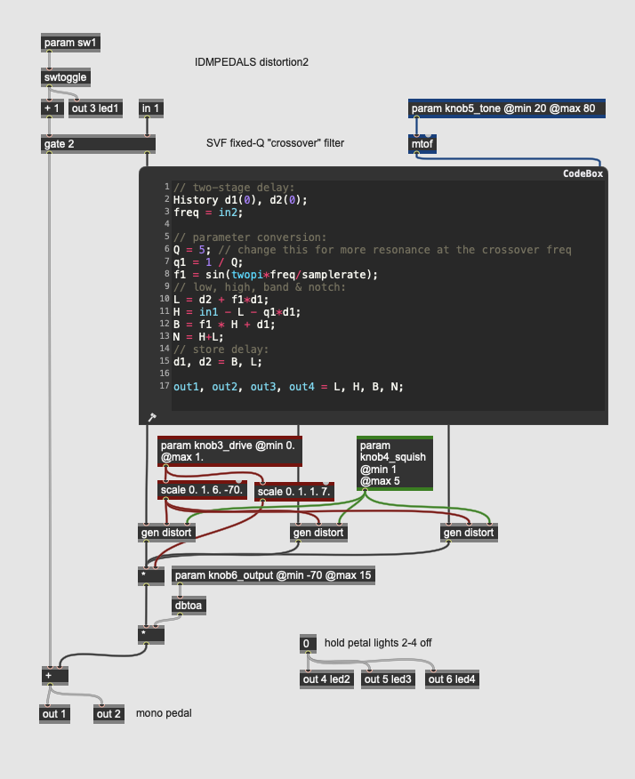
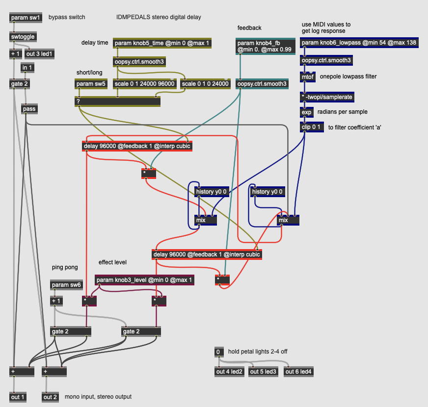
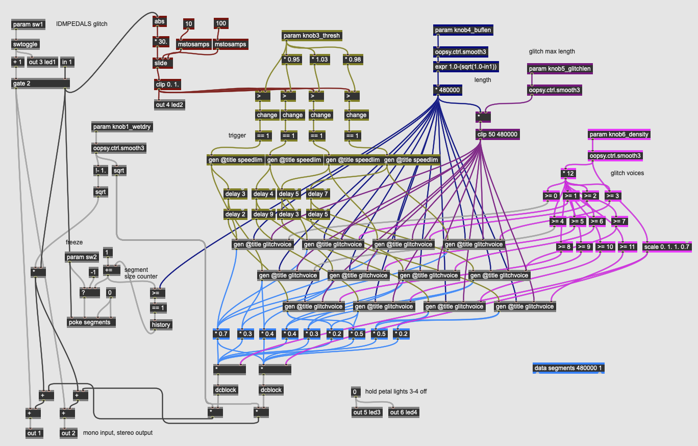

# IDM PEDALS

- [EQ](#eq)
  - [Lowpass Filter](#eq-lowpass)
  - [Parametric EQ](#eq-parametric)
  - [Fixed Crossover Filter](#eq-xover)
  - [Variable Crossover Filter](#eq-xover2)
  - [Mu-Tron Wah](#eq-wah)
  - [LFO Auto-Wah](#eq-wah2)
  - [Formant Filter](#eq-formant)
  - [Vocoder](#eq-vocoder)
- [Dynamics](#dynamics)
  - [Tremolo / Univibe](#dyn-tremolo)
  - [Compressor / Limiter](#dyn-compressor)
  - [Gate](#dyn-gate)
- [Distortion](#distortion)
  - [Overdrive](#dist-overdrive)
  - [Fuzz](#dist-fuzz)
  - [Octave Fuzz](#dist-octavia)
  - [Amp Distortion](#dist-distortion) 
  - [Crunch Distortion](#dist-distortion2) 
  - [Clipping, Folding, Wrapping](#dist-waveshaper) 
  - [Parametric Waveshaping](#dist-waveshaper2) 
- [Modulation](#modulation)
  - [Simple Chorus](#mod-chorus) 
  - [Chorus Ensemble](#mod-chorus2) 
  - [Flanger](#mod-flanger) 
  - [Simple Phaser](#mod-phaser) 
  - [Multi-stage Phaser](#mod-phaser2) 
  - [Harmonizer](#mod-harmonizer) 
  - [S&H Comb](#mod-shcomb) 
  - [Harmonic Filters](#mod-shcomb2) 
- [Delay](#delay)
  - [Digital Delay](#del-digitaldelay) 
  - [Multi-tap Delay](#del-digitaldelay2) 
  - [Chowning Reverb](#del-reverb) 
  - [Freeverb](#del-reverb2) 
  - [Creepy Reverb](#del-reverb3) 
- [Special FX](#special)
  - [Subharmonic Oscillator](#sfx-subharmonic) 
  - [Sample-and-Hold Sine](#sfx-shsine) 
  - [Ring Modulator](#sfx-ringmod) 
  - [Frequency Shifter](#sfx-freqshift) 
  - [FM Delay](#sfx-fmdelay) 
  - [Glitch Sampler](#sfx-glitch) 
  - [Reverse Sampler](#sfx-glitch2) 
  - [Yin Synthesizer](#sfx-yin) 

# Pedals

## EQ

Equalization effects are audio processors that work by adjusting different frequency bands in the input signal. These effects range from the subtle and utilitarian (e.g. a tone control which rolls off the treble) to more creative uses of equalization such as [wah-wah](https://en.wikipedia.org/wiki/Wah-wah_pedal) pedals. When working with analog or time-domain digital signals, equalization is done using [filters](https://en.wikipedia.org/wiki/Audio_filter).

### EQ Lowpass

This pedal implements a simple, one pole [lowpass filter](https://en.wikipedia.org/wiki/Low-pass_filter) with a single knob (**param knob3**, at the top-right) controlling the [cutoff frequency]. Time-domain filters are implemented using short delays, so the **history** operator, combined with the *mix* operator, do the actual filtering of the signal. The desired cutoff frequency coming from the parameter knob is intially expressed as a MIDI value in the range of 23 to 127 (30 Hz to 12.5 kHz).

*Hint: using a MIDI range as a parameter instead of frequency is a simple way to make the knob have a logarithmic frequency (or pitch linear) response; moving the knob by twelve steps, for example, will move the parameter by an octave anywhere in its range.*

After being smoothed and converted to frequency (using the **mtof** operator), the cutoff frequency is converted into the *a* coefficient for a simple lowpass filter:

yn = axn + byn-1

F = cutoff frequency

SR = sampling rate

x = -F*2π/SR

a = e^x

b = 1.0-a

This 

### EQ Parametric

### EQ Xover

### EQ Xover2

### EQ Wah

### EQ Wah2

### EQ Formant

### EQ Vocoder

## Dynamics

### Dyn Tremolo

### Dyn Compressor

### Dyn Gate

## Distortion

### Dist Overdrive

### Dist Fuzz

### Dist Octavia

### Dist Distortion

### Dist Distortion2

### Dist Waveshaper

### Dist Waveshaper2
    

## Modulation

### Mod Chorus

### Mod Chorus2

### Mod Flanger

### Mod Phaser

### Mod Phaser2

### Mod Harmonizer

### Mod Shcomb

### Mod Shcomb2

## Delay

### Del Digitaldelay

### Del Digitaldelay2

### Del Reverb

### Del Reverb2

### Del Reverb3
    

## Special

### Sfx Subharmonic

### Sfx Shsine

### Sfx Ringmod

### Sfx Freqshift

### Sfx Fmdelay

### Sfx Glitch

### Sfx Glitch2 

### Sfx Yin

[back to top](#top)

[return to main page](./index.md)

